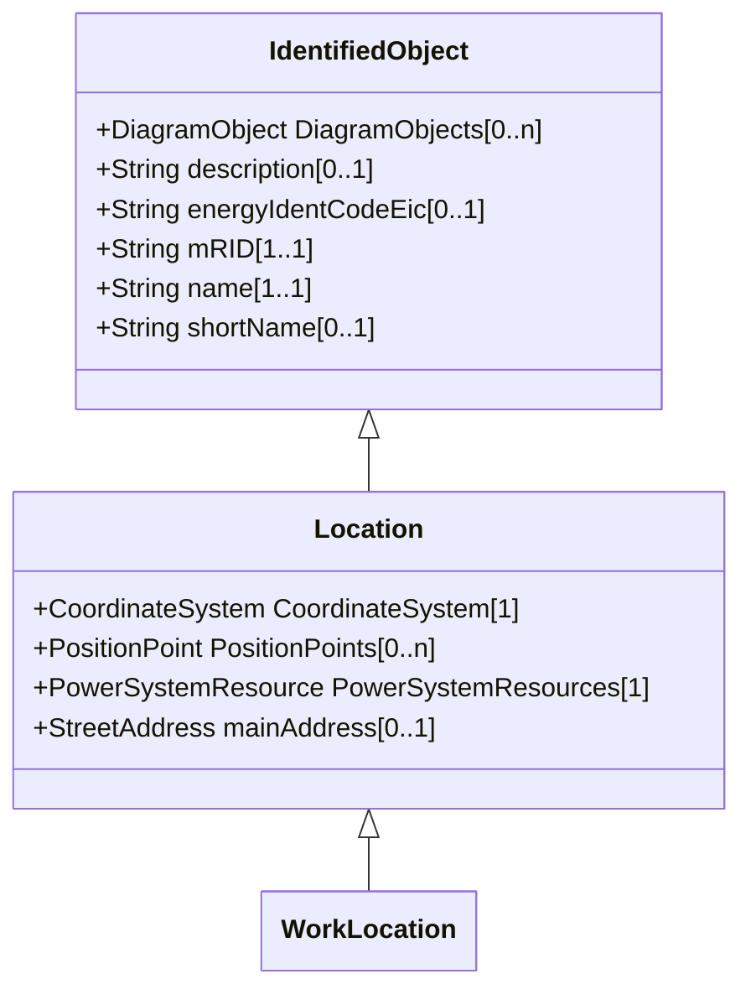

# Location

The place, scene, or point of something where someone or something has been, is, and/or will be at a given moment in time. It can be defined with one or more position points (coordinates) in a given coordinate system.

## Inheritance

<button class="mermaid-enlarge-button">Enlarge Diagram</button>

## Attributes

| Label | Type | Multiplicity | Comment |
|-------|------|--------------|---------|
| CoordinateSystem | [CoordinateSystem](CoordinateSystem.md) | 1 | Coordinate system used to describe position points of this location. |
| PositionPoints | [PositionPoint](PositionPoint.md) | 0..n | Sequence of position points describing this location, expressed in coordinate system 'Location.CoordinateSystem'. |
| PowerSystemResources | [PowerSystemResource](PowerSystemResource.md) | 1 | All power system resources at this location. |
| mainAddress | [StreetAddress](StreetAddress.md) | 0..1 | Main address of the location. |

