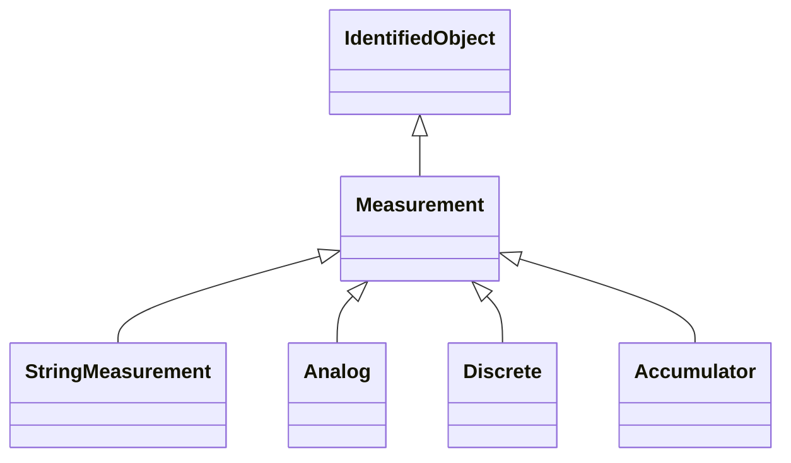

# Measurement

A Measurement represents any measured, calculated or non-measured non-calculated quantity. Any piece of equipment may contain Measurements, e.g. a substation may have temperature measurements and door open indications, a transformer may have oil temperature and tank pressure measurements, a bay may contain a number of power flow measurements and a Breaker may contain a switch status measurement. The PSR - Measurement association is intended to capture this use of Measurement and is included in the naming hierarchy based on EquipmentContainer. The naming hierarchy typically has Measurements as leaves, e.g. Substation-VoltageLevel-Bay-Switch-Measurement. Some Measurements represent quantities related to a particular sensor location in the network, e.g. a voltage transformer (VT) or potential transformer (PT) at a busbar or a current transformer (CT) at the bar between a breaker and an isolator. The sensing position is not captured in the PSR - Measurement association. Instead it is captured by the Measurement - Terminal association that is used to define the sensing location in the network topology. The location is defined by the connection of the Terminal to ConductingEquipment. If both a Terminal and PSR are associated, and the PSR is of type ConductingEquipment, the associated Terminal should belong to that ConductingEquipment instance. When the sensor location is needed both Measurement-PSR and Measurement-Terminal are used. The Measurement-Terminal association is never used alone.

## Inheritance

<button class="mermaid-enlarge-button">Enlarge Diagram</button>

## Attributes

| Label | Type | Multiplicity | Comment |
|-------|------|--------------|---------|
| PowerSystemResource | [PowerSystemResource](PowerSystemResource.md) | 1..1 | The power system resource that contains the measurement. |
| Terminal | [ACDCTerminal](ACDCTerminal.md) | 0..1 | One or more measurements may be associated with a terminal in the network. |
| measurementType | String | 1..1 | Specifies the type of measurement. For example, this specifies if the measurement represents an indoor temperature, outdoor temperature, bus voltage, line flow, etc. When the measurementType is set to 'Specialization', the type of Measurement is defined in more detail by the specialized class which inherits from Measurement. |
| phases | [PhaseCode](PhaseCode.md) | 0..1 | Indicates to which phases the measurement applies and avoids the need to use 'measurementType' to also encode phase information (which would explode the types). The phase information in Measurement, along with 'measurementType' and 'phases' uniquely defines a Measurement for a device, based on normal network phase. Their meaning will not change when the computed energizing phasing is changed due to jumpers or other reasons. If the attribute is missing three phases (ABC) shall be assumed. |
| unitMultiplier | [UnitMultiplier](UnitMultiplier.md) | 1..1 | The unit multiplier of the measured quantity. |
| unitSymbol | [UnitSymbol](UnitSymbol.md) | 1..1 | The unit of measure of the measured quantity. |

