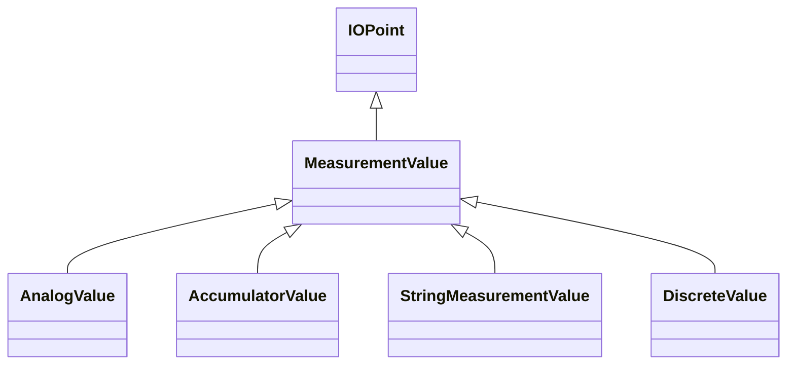

# MeasurementValue

The current state for a measurement. A state value is an instance of a measurement from a specific source. Measurements can be associated with many state values, each representing a different source for the measurement.

## Inheritance

<button class="mermaid-enlarge-button">Enlarge Diagram</button>

## Attributes

| Label | Type | Multiplicity | Comment |
|-------|------|--------------|---------|
| MeasurementValueQuality | [MeasurementValueQuality](MeasurementValueQuality.md) | 0..1 | A MeasurementValue has a MeasurementValueQuality associated with it. |
| MeasurementValueSource | [MeasurementValueSource](MeasurementValueSource.md) | 1 | A reference to the type of source that updates the MeasurementValue, e.g. SCADA, CCLink, manual, etc. User conventions for the names of sources are contained in the introduction to IEC 61970-301. |
| sensorAccuracy | Float | 0..1 | The limit, expressed as a percentage of the sensor maximum, that errors will not exceed when the sensor is used under reference conditions. |
| timeStamp | DateTime | 0..1 | The time when the value was last updated. |

