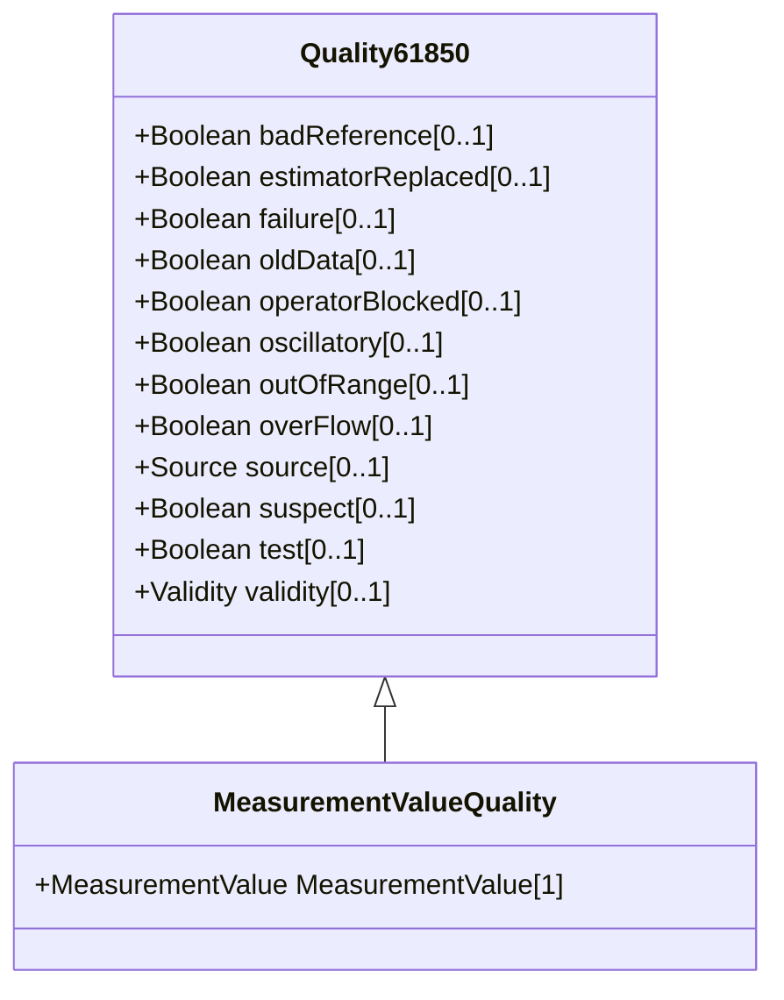

# MeasurementValueQuality

Measurement quality flags. Bits 0-10 are defined for substation automation in IEC 61850-7-3. Bits 11-15 are reserved for future expansion by that document. Bits 16-31 are reserved for EMS applications.

## Inheritance

<button class="mermaid-enlarge-button">Enlarge Diagram</button>

## Attributes

| Label | Type | Multiplicity | Comment |
|-------|------|--------------|---------|
| MeasurementValue | [MeasurementValue](MeasurementValue.md) | 1 | A MeasurementValue has a MeasurementValueQuality associated with it. |

