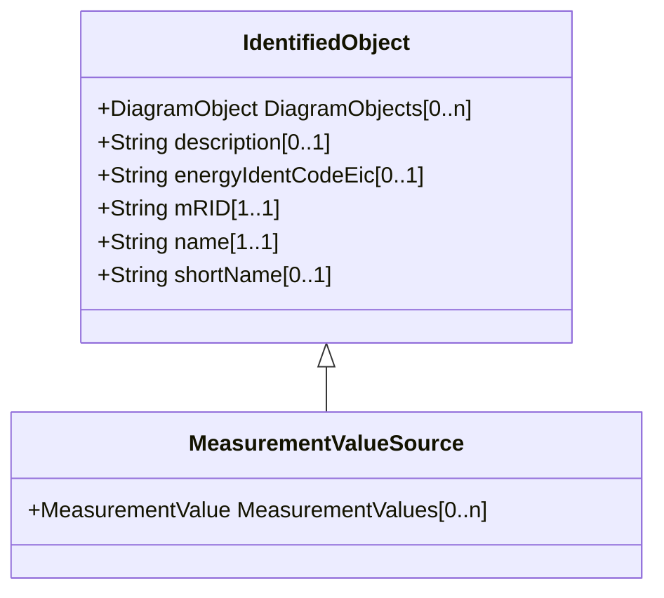

# MeasurementValueSource

MeasurementValueSource describes the alternative sources updating a MeasurementValue. User conventions for how to use the MeasurementValueSource attributes are defined in IEC 61970-301.

## Inheritance

<button class="mermaid-enlarge-button">Enlarge Diagram</button>

## Attributes

| Label | Type | Multiplicity | Comment |
|-------|------|--------------|---------|
| MeasurementValues | [MeasurementValue](MeasurementValue.md) | 0..n | The MeasurementValues updated by the source. |

