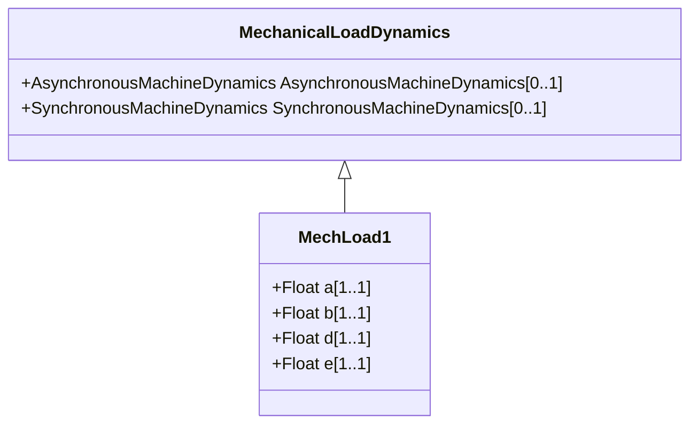

# MechLoad1

Mechanical load model type 1.

## Inheritance

<button class="mermaid-enlarge-button">Enlarge Diagram</button>

## Attributes

| Label | Type | Multiplicity | Comment |
|-------|------|--------------|---------|
| a | Float | 1..1 | Speed squared coefficient (a). |
| b | Float | 1..1 | Speed coefficient (b). |
| d | Float | 1..1 | Speed to the exponent coefficient (d). |
| e | Float | 1..1 | Exponent (e). |

