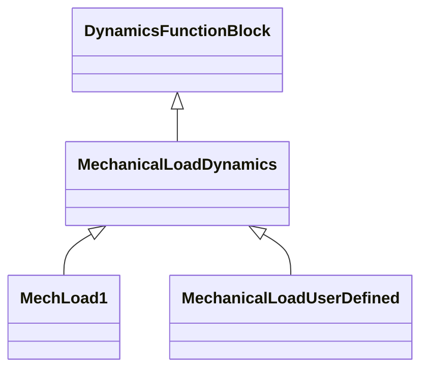

# MechanicalLoadDynamics

Mechanical load function block whose behaviour is described by reference to a standard model or by definition of a user-defined model.

## Inheritance

<button class="mermaid-enlarge-button">Enlarge Diagram</button>

## Attributes

| Label | Type | Multiplicity | Comment |
|-------|------|--------------|---------|
| AsynchronousMachineDynamics | [AsynchronousMachineDynamics](AsynchronousMachineDynamics.md) | 0..1 | Asynchronous machine model with which this mechanical load model is associated. MechanicalLoadDynamics shall have either an association to SynchronousMachineDynamics or to AsynchronousMachineDynamics. |
| SynchronousMachineDynamics | [SynchronousMachineDynamics](SynchronousMachineDynamics.md) | 0..1 | Synchronous machine model with which this mechanical load model is associated. MechanicalLoadDynamics shall have either an association to SynchronousMachineDynamics or AsynchronousMachineDyanmics. |

