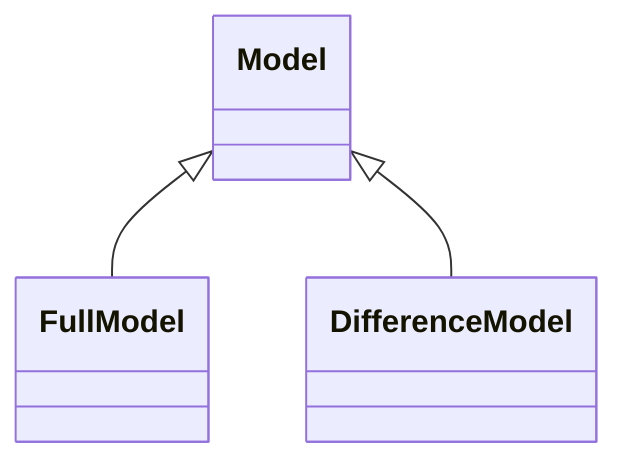

# Model

A Model is a collection of data describing instances, objects or entities, real or computed. In the context of CIM the semantics of the data is defined by profiles. Hence a model can contain equipment data, power flow initial values, power flow results etc. The Model class describes the header content that is the same for the FullModel and the DifferenceModel. A Model is identified by an rdf:about attribute. The rdf:about attribute uniquely describe the model data and not the CIMXML document. A new rdf:about identification is generated for created documents only when the model data has changed. A repeated creation of documents from unchanged model data shall have the same rdf:about identification as previous document generated from the same model data.

## Inheritance

<button class="mermaid-enlarge-button">Enlarge Diagram</button>

## Attributes

| Label | Type | Multiplicity | Comment |
|-------|------|--------------|---------|
| DependentOn | [Model](Model.md) | 0..n | A reference to the model documents that the model described by this document depends on. In general there can be 0 or many Model.DependentOn depending on the profile and the content of the instance file. For instance: - A load flow solution depends on the topology model it was computed from - A topology model computed by a topology processor depends on the network model it was computed from. The referenced models are identified by the FullModel rdf:about attribute for full model documents and by DifferenceModel rdf:about attribute for difference model documents. The references are maintained by the producer of the CIMXML document and the references are valid for the model with version and identifier for which the document was created. |
| Depending | [Model](Model.md) | 0..n | All documents depending on the model described by this document. This role is not intended to be included in any document exchanging instance data. |
| SupersededBy | [Model](Model.md) | 0..n | All models superseding this model. This role is not intended to be included in any document exchanging instance data. |
| Supersedes | [Model](Model.md) | 0..n | When a model is updated the resulting model supersedes the models that were used as basis for the update. Hence this is a reference to the CIMXML documents which are superseded by this model. A model (or instance file) can supersede 1 or more models, e.g. a difference model or a full model supersede multiple models (difference or full). In this case more than one Model.Supersedes are included in the header. The referenced document(s) is (are) identified by the URN/MRID/UUID in the FullModel rdf:about attribute when full model(s) is (are) referenced and by the URN/MRID/UUID in the DifferenceModel rdf:about attribute when difference model(s) is (are) referenced. |
| created | DateTime | 1..1 | The date and time when the model was created. It is the time of the serialization. The format is an extended format according to the ISO 8601-2005. European exchanges shall refer to UTC, e.g. 2014-05-15T17:48:31.474Z. |
| description | String | 1..1 | A description of the model, e.g. the name of person that created the model and for what purpose. The number of UTF-8 characters is limited to 2000. |
| modelingAuthoritySet | [URI](URI.md) | 1..1 | A URN/URI referring to the organisation role / model authority set reference. The organization role is the source of the model. It is the same for all profiles part of a model exchange. |
| profile | [URI](URI.md) | 1..n | URN/URI describing the profiles that governs this model. It uniquely identifies the profiles and its version, e.g. http://iec.ch/TC57/61970-456/SteadyStateHypothesis/2/0. |
| scenarioTime | DateTime | 1..1 | The date and time that this model represents, i.e. for which the model is valid. The format is an extended format according to the ISO 8601-2005. European exchanges shall refer to UTC, e.g. 2030-01-15T17:00:00.000Z. |
| version | Integer | 1..1 | The version of the model. If the instance file is imported and exported with no change the version number is the kept same. The version changes only if the content of the file changes. It is the same logic as for the header id. The version is the human readable id. |

