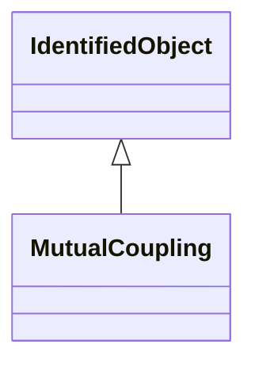

# MutualCoupling

This class represents the zero sequence line mutual coupling.

## Inheritance

<button class="mermaid-enlarge-button">Enlarge Diagram</button>

## Attributes

| Label | Type | Multiplicity | Comment |
|-------|------|--------------|---------|
| First_Terminal | [Terminal](Terminal.md) | 1 | The starting terminal for the calculation of distances along the first branch of the mutual coupling. Normally MutualCoupling would only be used for terminals of AC line segments. The first and second terminals of a mutual coupling should point to different AC line segments. |
| Second_Terminal | [Terminal](Terminal.md) | 1 | The starting terminal for the calculation of distances along the second branch of the mutual coupling. |
| b0ch | Float | 1..1 | Zero sequence mutual coupling shunt (charging) susceptance, uniformly distributed, of the entire line section. |
| distance11 | Float | 1..1 | Distance to the start of the coupled region from the first line's terminal having sequence number equal to 1. |
| distance12 | Float | 1..1 | Distance to the end of the coupled region from the first line's terminal with sequence number equal to 1. |
| distance21 | Float | 1..1 | Distance to the start of coupled region from the second line's terminal with sequence number equal to 1. |
| distance22 | Float | 1..1 | Distance to the end of coupled region from the second line's terminal with sequence number equal to 1. |
| g0ch | Float | 1..1 | Zero sequence mutual coupling shunt (charging) conductance, uniformly distributed, of the entire line section. |
| r0 | Float | 1..1 | Zero sequence branch-to-branch mutual impedance coupling, resistance. |
| x0 | Float | 1..1 | Zero sequence branch-to-branch mutual impedance coupling, reactance. |

