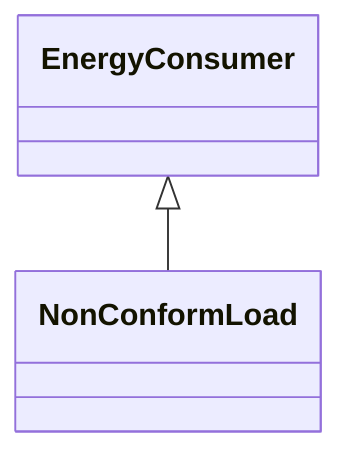

# NonConformLoad

NonConformLoad represents loads that do not follow a daily load change pattern and whose changes are not correlated with the daily load change pattern.

## Inheritance

<button class="mermaid-enlarge-button">Enlarge Diagram</button>

## Attributes

| Label | Type | Multiplicity | Comment |
|-------|------|--------------|---------|
| LoadGroup | [NonConformLoadGroup](NonConformLoadGroup.md) | 1 | Group of this ConformLoad. |

