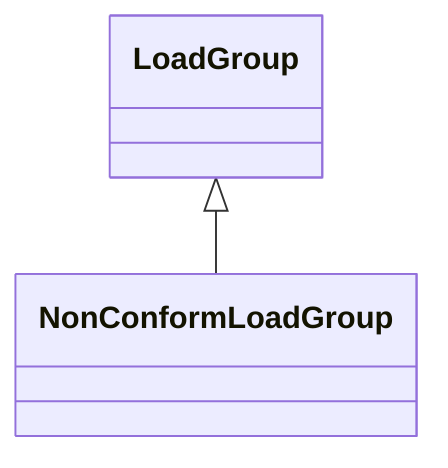

# NonConformLoadGroup

Loads that do not follow a daily and seasonal load variation pattern.

## Inheritance

<button class="mermaid-enlarge-button">Enlarge Diagram</button>

## Attributes

| Label | Type | Multiplicity | Comment |
|-------|------|--------------|---------|
| EnergyConsumers | [NonConformLoad](NonConformLoad.md) | 1..n | Conform loads assigned to this ConformLoadGroup. |
| NonConformLoadSchedules | [NonConformLoadSchedule](NonConformLoadSchedule.md) | 0..n | The NonConformLoadSchedules in the NonConformLoadGroup. |

