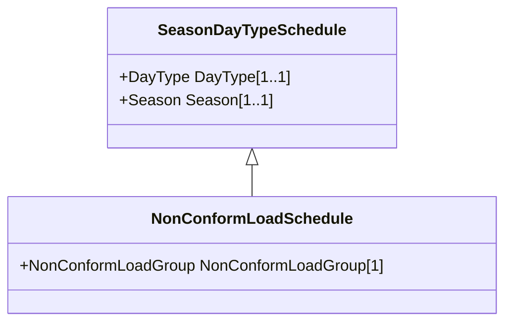

# NonConformLoadSchedule

An active power (Y1-axis) and reactive power (Y2-axis) schedule (curves) versus time (X-axis) for non-conforming loads, e.g., large industrial load or power station service (where modelled).

## Inheritance

<button class="mermaid-enlarge-button">Enlarge Diagram</button>

## Attributes

| Label | Type | Multiplicity | Comment |
|-------|------|--------------|---------|
| NonConformLoadGroup | [NonConformLoadGroup](NonConformLoadGroup.md) | 1 | The NonConformLoadGroup where the NonConformLoadSchedule belongs. |

