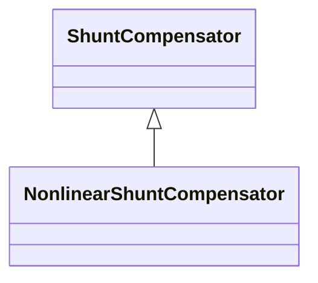

# NonlinearShuntCompensator

A non linear shunt compensator has bank or section admittance values that differ. The attributes g, b, g0 and b0 of the associated NonlinearShuntCompensatorPoint describe the total conductance and admittance of a NonlinearShuntCompensatorPoint at a section number specified by NonlinearShuntCompensatorPoint.sectionNumber.

## Inheritance

<button class="mermaid-enlarge-button">Enlarge Diagram</button>

## Attributes

| Label | Type | Multiplicity | Comment |
|-------|------|--------------|---------|
| NonlinearShuntCompensatorPoints | [NonlinearShuntCompensatorPoint](NonlinearShuntCompensatorPoint.md) | 1..n | All points of the non-linear shunt compensator. |

