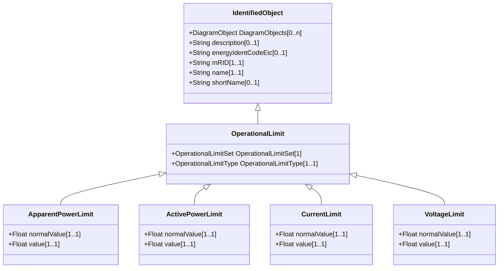

# OperationalLimit

A value and normal value associated with a specific kind of limit. The sub class value and normalValue attributes vary inversely to the associated OperationalLimitType.acceptableDuration (acceptableDuration for short). If a particular piece of equipment has multiple operational limits of the same kind (apparent power, current, etc.), the limit with the greatest acceptableDuration shall have the smallest limit value and the limit with the smallest acceptableDuration shall have the largest limit value. Note: A large current can only be allowed to flow through a piece of equipment for a short duration without causing damage, but a lesser current can be allowed to flow for a longer duration.

## Inheritance

<button class="mermaid-enlarge-button">Enlarge Diagram</button>

## Attributes

| Label | Type | Multiplicity | Comment |
|-------|------|--------------|---------|
| OperationalLimitSet | [OperationalLimitSet](OperationalLimitSet.md) | 1 | The limit set to which the limit values belong. |
| OperationalLimitType | [OperationalLimitType](OperationalLimitType.md) | 1..1 | The limit type associated with this limit. |

