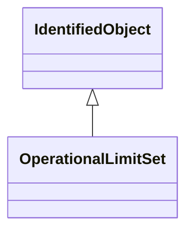

# OperationalLimitSet

A set of limits associated with equipment. Sets of limits might apply to a specific temperature, or season for example. A set of limits may contain different severities of limit levels that would apply to the same equipment. The set may contain limits of different types such as apparent power and current limits or high and low voltage limits that are logically applied together as a set.

## Inheritance

<button class="mermaid-enlarge-button">Enlarge Diagram</button>

## Attributes

| Label | Type | Multiplicity | Comment |
|-------|------|--------------|---------|
| Equipment | [Equipment](Equipment.md) | 0..1 | The equipment to which the limit set applies. |
| OperationalLimitValue | [OperationalLimit](OperationalLimit.md) | 0..n | Values of equipment limits. |
| Terminal | [ACDCTerminal](ACDCTerminal.md) | 1 | The terminal where the operational limit set apply. |

