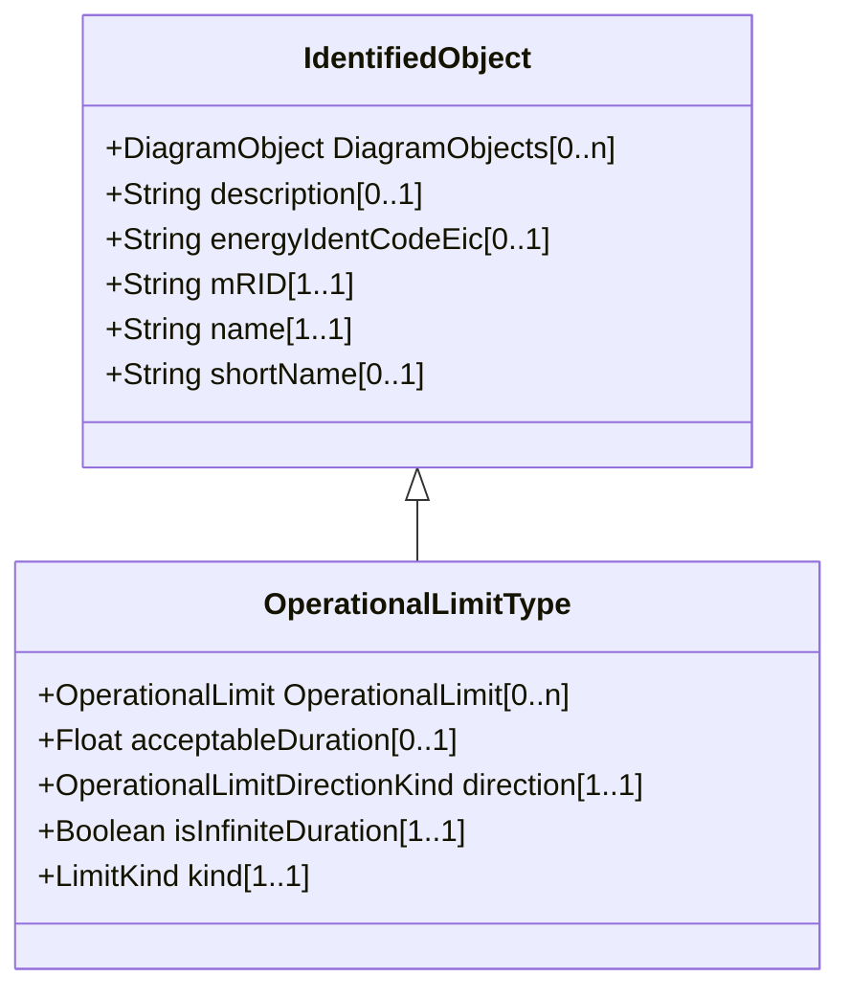

# OperationalLimitType

The operational meaning of a category of limits.

## Inheritance

<button class="mermaid-enlarge-button">Enlarge Diagram</button>

## Attributes

| Label | Type | Multiplicity | Comment |
|-------|------|--------------|---------|
| OperationalLimit | [OperationalLimit](OperationalLimit.md) | 0..n | The operational limits associated with this type of limit. |
| acceptableDuration | Float | 0..1 | The nominal acceptable duration of the limit. Limits are commonly expressed in terms of the time limit for which the limit is normally acceptable. The actual acceptable duration of a specific limit may depend on other local factors such as temperature or wind speed. The attribute has meaning only if the flag isInfiniteDuration is set to false, hence it shall not be exchanged when isInfiniteDuration is set to true. |
| direction | [OperationalLimitDirectionKind](OperationalLimitDirectionKind.md) | 1..1 | The direction of the limit. |
| isInfiniteDuration | Boolean | 1..1 | Defines if the operational limit type has infinite duration. If true, the limit has infinite duration. If false, the limit has definite duration which is defined by the attribute acceptableDuration. |
| kind | [LimitKind](LimitKind.md) | 1..1 | Types of limits defined in the ENTSO-E Operational Handbook Policy 3. |

