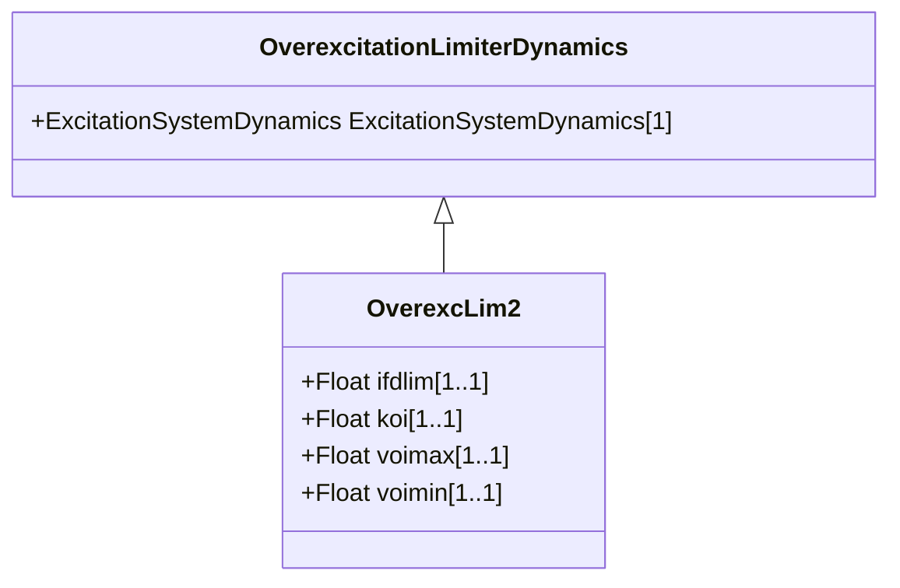

# OverexcLim2

Different from LimIEEEOEL, LimOEL2 has a fixed pickup threshold and reduces the excitation set-point by means of a non-windup integral regulator. Irated is the rated machine excitation current (calculated from nameplate conditions: Vnom, Pnom, CosPhinom).

## Inheritance

<button class="mermaid-enlarge-button">Enlarge Diagram</button>

## Attributes

| Label | Type | Multiplicity | Comment |
|-------|------|--------------|---------|
| ifdlim | Float | 1..1 | Limit value of rated field current (IFDLIM). Typical value = 1,05. |
| koi | Float | 1..1 | Gain Over excitation limiter (KOI). Typical value = 0,1. |
| voimax | Float | 1..1 | Maximum error signal (VOIMAX) (> OverexcLim2.voimin). Typical value = 0. |
| voimin | Float | 1..1 | Minimum error signal (VOIMIN) (< OverexcLim2.voimax). Typical value = -9999. |

