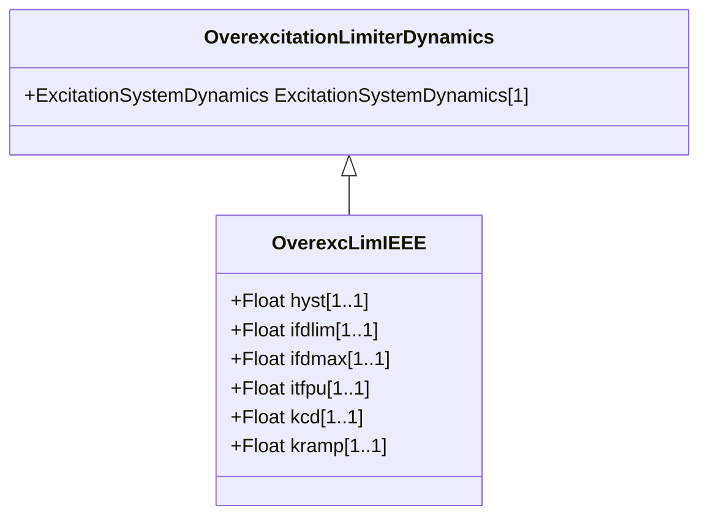

# OverexcLimIEEE

The over excitation limiter model is intended to represent the significant features of OELs necessary for some large-scale system studies. It is the result of a pragmatic approach to obtain a model that can be widely applied with attainable data from generator owners. An attempt to include all variations in the functionality of OELs and duplicate how they interact with the rest of the excitation systems would likely result in a level of application insufficient for the studies for which they are intended. Reference: IEEE OEL 421.5-2005, 9.

## Inheritance

<button class="mermaid-enlarge-button">Enlarge Diagram</button>

## Attributes

| Label | Type | Multiplicity | Comment |
|-------|------|--------------|---------|
| hyst | Float | 1..1 | OEL pickup/drop-out hysteresis (HYST). Typical value = 0,03. |
| ifdlim | Float | 1..1 | OEL timed field current limit (IFDLIM). Typical value = 1,05. |
| ifdmax | Float | 1..1 | OEL instantaneous field current limit (IFDMAX). Typical value = 1,5. |
| itfpu | Float | 1..1 | OEL timed field current limiter pickup level (ITFPU). Typical value = 1,05. |
| kcd | Float | 1..1 | OEL cooldown gain (KCD). Typical value = 1. |
| kramp | Float | 1..1 | OEL ramped limit rate (KRAMP). Unit = PU / s. Typical value = 10. |

