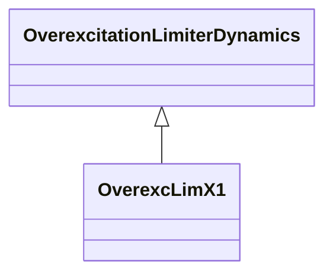

# OverexcLimX1

Field voltage over excitation limiter.

## Inheritance

<button class="mermaid-enlarge-button">Enlarge Diagram</button>

## Attributes

| Label | Type | Multiplicity | Comment |
|-------|------|--------------|---------|
| efd1 | Float | 1..1 | Low voltage point on the inverse time characteristic (EFD1). Typical value = 1,1. |
| efd2 | Float | 1..1 | Mid voltage point on the inverse time characteristic (EFD2). Typical value = 1,2. |
| efd3 | Float | 1..1 | High voltage point on the inverse time characteristic (EFD3). Typical value = 1,5. |
| efddes | Float | 1..1 | Desired field voltage (EFDDES). Typical value = 0,9. |
| efdrated | Float | 1..1 | Rated field voltage (EFDRATED). Typical value = 1,05. |
| kmx | Float | 1..1 | Gain (KMX). Typical value = 0,01. |
| t1 | Float | 1..1 | Time to trip the exciter at the low voltage point on the inverse time characteristic (TIME1) (>= 0). Typical value = 120. |
| t2 | Float | 1..1 | Time to trip the exciter at the mid voltage point on the inverse time characteristic (TIME2) (>= 0). Typical value = 40. |
| t3 | Float | 1..1 | Time to trip the exciter at the high voltage point on the inverse time characteristic (TIME3) (>= 0). Typical value = 15. |
| vlow | Float | 1..1 | Low voltage limit (VLOW) (> 0). |

