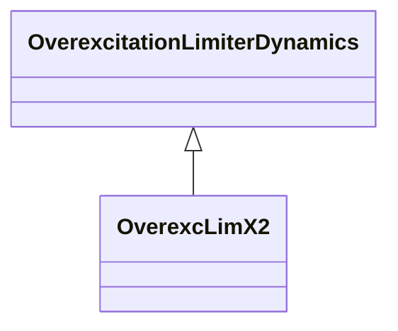

# OverexcLimX2

Field voltage or current overexcitation limiter designed to protect the generator field of an AC machine with automatic excitation control from overheating due to prolonged overexcitation.

## Inheritance

<button class="mermaid-enlarge-button">Enlarge Diagram</button>

## Attributes

| Label | Type | Multiplicity | Comment |
|-------|------|--------------|---------|
| efd1 | Float | 1..1 | Low voltage or current point on the inverse time characteristic (EFD1). Typical value = 1,1. |
| efd2 | Float | 1..1 | Mid voltage or current point on the inverse time characteristic (EFD2). Typical value = 1,2. |
| efd3 | Float | 1..1 | High voltage or current point on the inverse time characteristic (EFD3). Typical value = 1,5. |
| efddes | Float | 1..1 | Desired field voltage if m = false or desired field current if m = true (EFDDES). Typical value = 1. |
| efdrated | Float | 1..1 | Rated field voltage if m = false or rated field current if m = true (EFDRATED). Typical value = 1,05. |
| kmx | Float | 1..1 | Gain (KMX). Typical value = 0,002. |
| m | Boolean | 1..1 | (m). true = IFD limiting false = EFD limiting. |
| t1 | Float | 1..1 | Time to trip the exciter at the low voltage or current point on the inverse time characteristic (TIME1) (>= 0). Typical value = 120. |
| t2 | Float | 1..1 | Time to trip the exciter at the mid voltage or current point on the inverse time characteristic (TIME2) (>= 0). Typical value = 40. |
| t3 | Float | 1..1 | Time to trip the exciter at the high voltage or current point on the inverse time characteristic (TIME3) (>= 0). Typical value = 15. |
| vlow | Float | 1..1 | Low voltage limit (VLOW) (> 0). |

