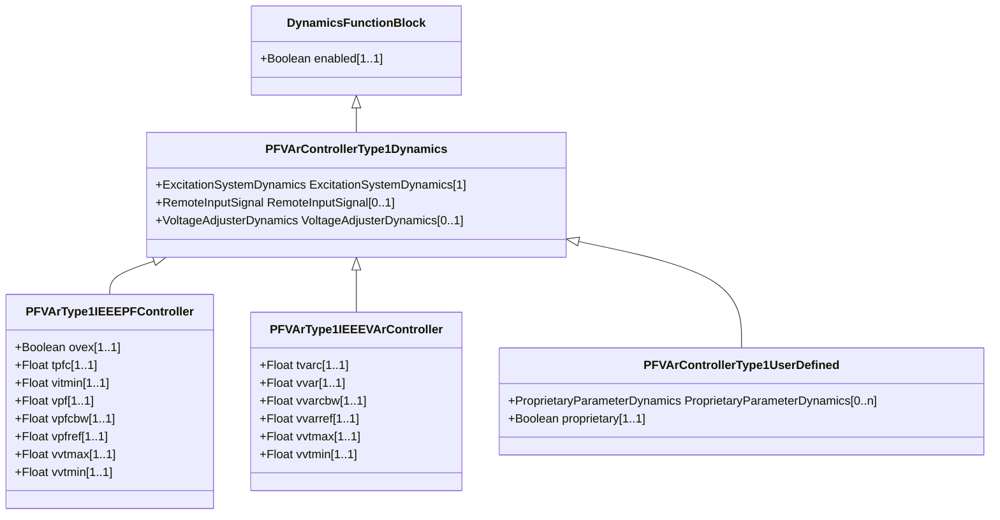

# PFVArControllerType1Dynamics

Power factor or VAr controller type 1 function block whose behaviour is described by reference to a standard model or by definition of a user-defined model.

## Inheritance

<button class="mermaid-enlarge-button">Enlarge Diagram</button>

## Attributes

| Label | Type | Multiplicity | Comment |
|-------|------|--------------|---------|
| ExcitationSystemDynamics | [ExcitationSystemDynamics](ExcitationSystemDynamics.md) | 1 | Excitation system model with which this power actor or VAr controller type 1 model is associated. |
| RemoteInputSignal | [RemoteInputSignal](RemoteInputSignal.md) | 0..1 | Remote input signal used by this power factor or VAr controller type 1 model. |
| VoltageAdjusterDynamics | [VoltageAdjusterDynamics](VoltageAdjusterDynamics.md) | 0..1 | Voltage adjuster model associated with this power factor or VAr controller type 1 model. |

