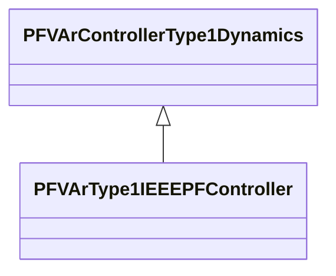

# PFVArType1IEEEPFController

IEEE PF controller type 1 which operates by moving the voltage reference directly. Reference: IEEE 421.5-2005, 11.2.

## Inheritance

<button class="mermaid-enlarge-button">Enlarge Diagram</button>

## Attributes

| Label | Type | Multiplicity | Comment |
|-------|------|--------------|---------|
| ovex | Boolean | 1..1 | Overexcitation Flag (OVEX) true = overexcited false = underexcited. |
| tpfc | Float | 1..1 | PF controller time delay (TPFC) (>= 0). Typical value = 5. |
| vitmin | Float | 1..1 | Minimum machine terminal current needed to enable pf/var controller (VITMIN). |
| vpf | Float | 1..1 | Synchronous machine power factor (VPF). |
| vpfcbw | Float | 1..1 | PF controller deadband (VPFC_BW). Typical value = 0,05. |
| vpfref | Float | 1..1 | PF controller reference (VPFREF). |
| vvtmax | Float | 1..1 | Maximum machine terminal voltage needed for pf/var controller to be enabled (VVTMAX) (> PFVArType1IEEEPFController.vvtmin). |
| vvtmin | Float | 1..1 | Minimum machine terminal voltage needed to enable pf/var controller (VVTMIN) (< PFVArType1IEEEPFController.vvtmax). |

