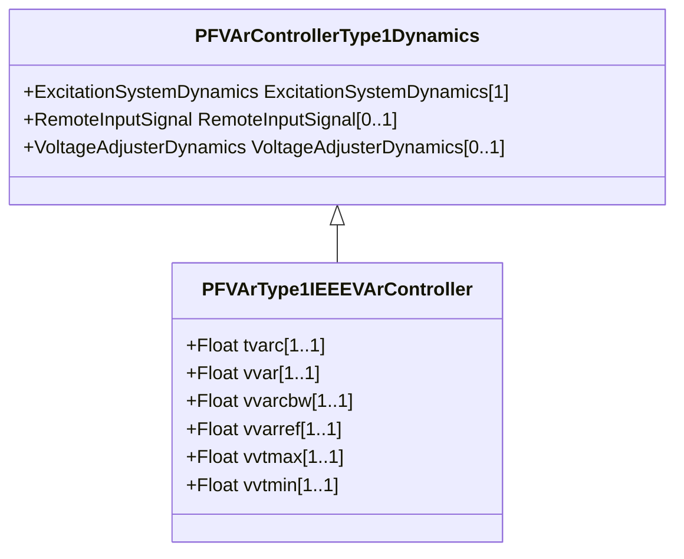

# PFVArType1IEEEVArController

IEEE VAR controller type 1 which operates by moving the voltage reference directly. Reference: IEEE 421.5-2005, 11.3.

## Inheritance

<button class="mermaid-enlarge-button">Enlarge Diagram</button>

## Attributes

| Label | Type | Multiplicity | Comment |
|-------|------|--------------|---------|
| tvarc | Float | 1..1 | Var controller time delay (TVARC) (>= 0). Typical value = 5. |
| vvar | Float | 1..1 | Synchronous machine power factor (VVAR). |
| vvarcbw | Float | 1..1 | Var controller deadband (VVARC_BW). Typical value = 0,02. |
| vvarref | Float | 1..1 | Var controller reference (VVARREF). |
| vvtmax | Float | 1..1 | Maximum machine terminal voltage needed for pf/VAr controller to be enabled (VVTMAX) (> PVFArType1IEEEVArController.vvtmin). |
| vvtmin | Float | 1..1 | Minimum machine terminal voltage needed to enable pf/var controller (VVTMIN) (< PVFArType1IEEEVArController.vvtmax). |

