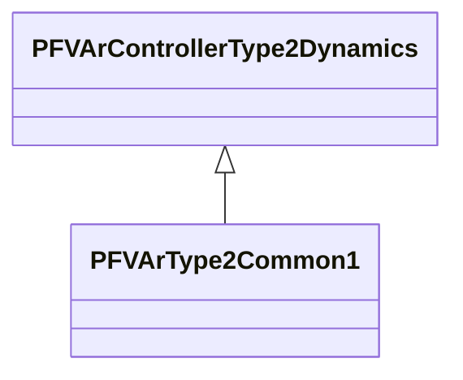

# PFVArType2Common1

Power factor / reactive power regulator. This model represents the power factor or reactive power controller such as the Basler SCP-250. The controller measures power factor or reactive power (PU on generator rated power) and compares it with the operator's set point. [Footnote: Basler SCP-250 is an example of a suitable product available commercially. This information is given for the convenience of users of this document and does not constitute an endorsement by IEC of this product.]

## Inheritance

<button class="mermaid-enlarge-button">Enlarge Diagram</button>

## Attributes

| Label | Type | Multiplicity | Comment |
|-------|------|--------------|---------|
| j | Boolean | 1..1 | Selector (J). true = control mode for reactive power false = control mode for power factor. |
| ki | Float | 1..1 | Reset gain (Ki). |
| kp | Float | 1..1 | Proportional gain (Kp). |
| max | Float | 1..1 | Output limit (max). |
| ref | Float | 1..1 | Reference value of reactive power or power factor (Ref). The reference value is initialised by this model. This initialisation can override the value exchanged by this attribute to represent a plant operator's change of the reference setting. |

