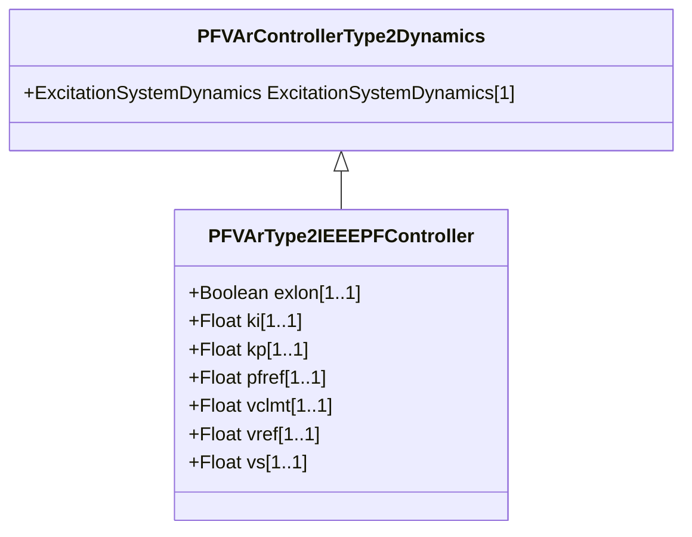

# PFVArType2IEEEPFController

IEEE PF controller type 2 which is a summing point type controller making up the outside loop of a two-loop system. This controller is implemented as a slow PI type controller. The voltage regulator forms the inner loop and is implemented as a fast controller. Reference: IEEE 421.5-2005, 11.4.

## Inheritance

<button class="mermaid-enlarge-button">Enlarge Diagram</button>

## Attributes

| Label | Type | Multiplicity | Comment |
|-------|------|--------------|---------|
| exlon | Boolean | 1..1 | Overexcitation or under excitation flag (EXLON) true = 1 (not in the overexcitation or underexcitation state, integral action is active) false = 0 (in the overexcitation or underexcitation state, so integral action is disabled to allow the limiter to play its role). |
| ki | Float | 1..1 | Integral gain of the pf controller (KI). Typical value = 1. |
| kp | Float | 1..1 | Proportional gain of the pf controller (KP). Typical value = 1. |
| pfref | Float | 1..1 | Power factor reference (PFREF). |
| vclmt | Float | 1..1 | Maximum output of the pf controller (VCLMT). Typical value = 0,1. |
| vref | Float | 1..1 | Voltage regulator reference (VREF). |
| vs | Float | 1..1 | Generator sensing voltage (VS). |

