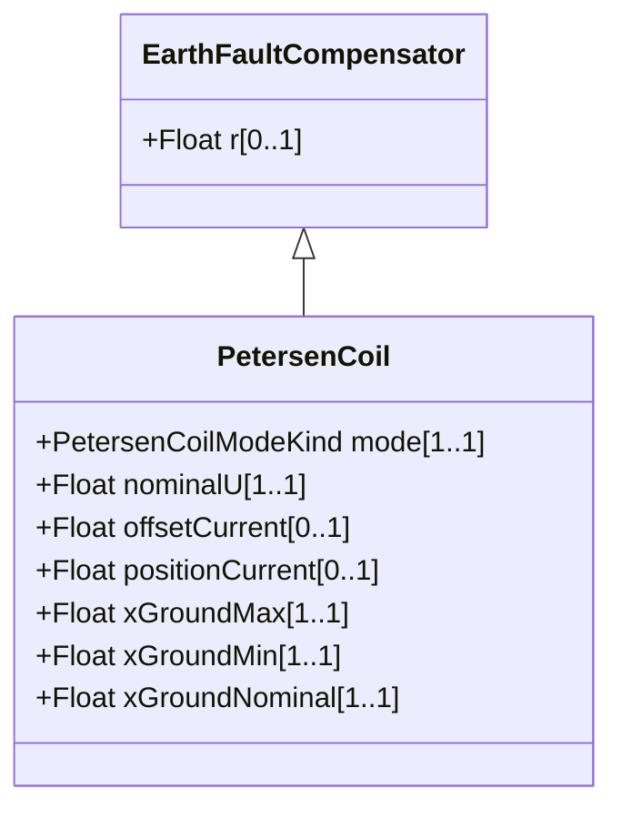

# PetersenCoil

A variable impedance device normally used to offset line charging during single line faults in an ungrounded section of network.

## Inheritance

<button class="mermaid-enlarge-button">Enlarge Diagram</button>

## Attributes

| Label | Type | Multiplicity | Comment |
|-------|------|--------------|---------|
| mode | [PetersenCoilModeKind](PetersenCoilModeKind.md) | 1..1 | The mode of operation of the Petersen coil. |
| nominalU | Float | 1..1 | The nominal voltage for which the coil is designed. |
| offsetCurrent | Float | 0..1 | The offset current that the Petersen coil controller is operating from the resonant point. This is normally a fixed amount for which the controller is configured and could be positive or negative. Typically 0 to 60 A depending on voltage and resonance conditions. |
| positionCurrent | Float | 0..1 | The control current used to control the Petersen coil also known as the position current. Typically in the range of 20 mA to 200 mA. |
| xGroundMax | Float | 1..1 | The maximum reactance. |
| xGroundMin | Float | 1..1 | The minimum reactance. |
| xGroundNominal | Float | 1..1 | The nominal reactance. This is the operating point (normally over compensation) that is defined based on the resonance point in the healthy network condition. The impedance is calculated based on nominal voltage divided by position current. |

