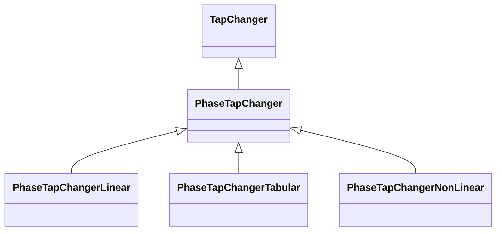

# PhaseTapChanger

A transformer phase shifting tap model that controls the phase angle difference across the power transformer and potentially the active power flow through the power transformer. This phase tap model may also impact the voltage magnitude.

## Inheritance

<button class="mermaid-enlarge-button">Enlarge Diagram</button>

## Attributes

| Label | Type | Multiplicity | Comment |
|-------|------|--------------|---------|
| TransformerEnd | [TransformerEnd](TransformerEnd.md) | 1 | Transformer end to which this phase tap changer belongs. |

