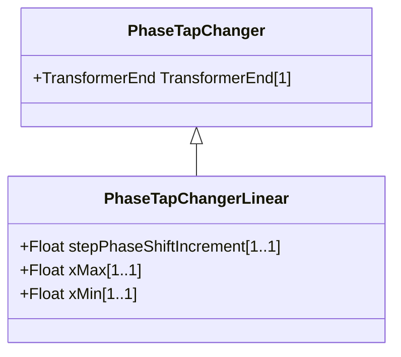

# PhaseTapChangerLinear

Describes a tap changer with a linear relation between the tap step and the phase angle difference across the transformer. This is a mathematical model that is an approximation of a real phase tap changer. The phase angle is computed as stepPhaseShiftIncrement times the tap position. The voltage magnitude of both sides is the same.

## Inheritance

<button class="mermaid-enlarge-button">Enlarge Diagram</button>

## Attributes

| Label | Type | Multiplicity | Comment |
|-------|------|--------------|---------|
| stepPhaseShiftIncrement | Float | 1..1 | Phase shift per step position. A positive value indicates a positive angle variation from the Terminal at the PowerTransformerEnd, where the TapChanger is located, into the transformer. The actual phase shift increment might be more accurately computed from the symmetrical or asymmetrical models or a tap step table lookup if those are available. |
| xMax | Float | 1..1 | The reactance depends on the tap position according to a 'u' shaped curve. The maximum reactance (xMax) appears at the low and high tap positions. Depending on the “u” curve the attribute can be either higher or lower than PowerTransformerEnd.x. |
| xMin | Float | 1..1 | The reactance depends on the tap position according to a 'u' shaped curve. The minimum reactance (xMin) appears at the mid tap position. PowerTransformerEnd.x shall be consistent with PhaseTapChangerLinear.xMin and PhaseTapChangerNonLinear.xMin. In case of inconsistency, PowerTransformerEnd.x shall be used. |

