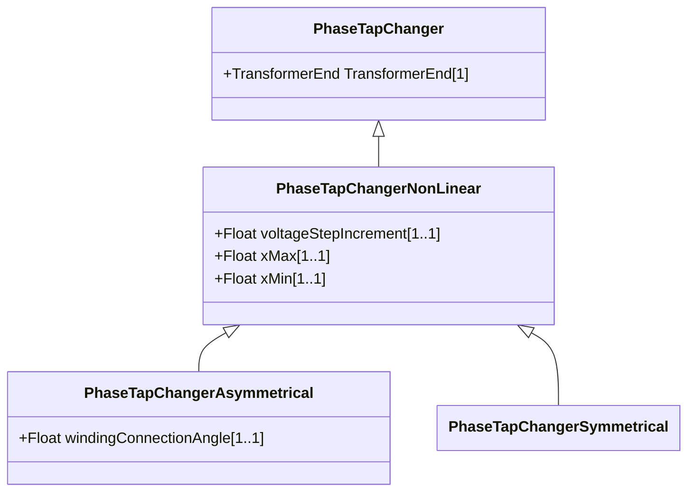

# PhaseTapChangerNonLinear

The non-linear phase tap changer describes the non-linear behaviour of a phase tap changer. This is a base class for the symmetrical and asymmetrical phase tap changer models. The details of these models can be found in IEC 61970-301.

## Inheritance

<button class="mermaid-enlarge-button">Enlarge Diagram</button>

## Attributes

| Label | Type | Multiplicity | Comment |
|-------|------|--------------|---------|
| voltageStepIncrement | Float | 1..1 | The voltage step increment on the out of phase winding (the PowerTransformerEnd where the TapChanger is located) specified in percent of rated voltage of the PowerTransformerEnd. A positive value means a positive voltage variation from the Terminal at the PowerTransformerEnd, where the TapChanger is located, into the transformer. When the increment is negative, the voltage decreases when the tap step increases. |
| xMax | Float | 1..1 | The reactance depends on the tap position according to a 'u' shaped curve. The maximum reactance (xMax) appears at the low and high tap positions. Depending on the “u” curve the attribute can be either higher or lower than PowerTransformerEnd.x. |
| xMin | Float | 1..1 | The reactance depend on the tap position according to a 'u' shaped curve. The minimum reactance (xMin) appear at the mid tap position. PowerTransformerEnd.x shall be consistent with PhaseTapChangerLinear.xMin and PhaseTapChangerNonLinear.xMin. In case of inconsistency, PowerTransformerEnd.x shall be used. |

