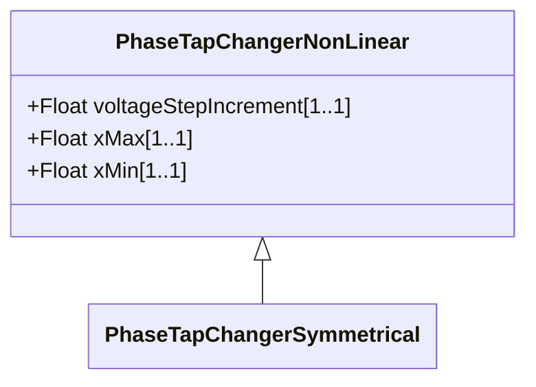

# PhaseTapChangerSymmetrical

Describes a symmetrical phase shifting transformer tap model in which the voltage magnitude of both sides is the same. The difference voltage magnitude is the base in an equal-sided triangle where the sides corresponds to the primary and secondary voltages. The phase angle difference corresponds to the top angle and can be expressed as twice the arctangent of half the total difference voltage.

## Inheritance

<button class="mermaid-enlarge-button">Enlarge Diagram</button>

## Attributes

| Label | Type | Multiplicity | Comment |
|-------|------|--------------|---------|
| No attributes | | | |

