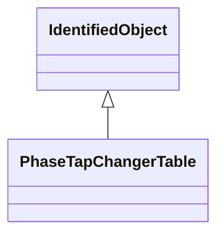

# PhaseTapChangerTable

Describes a tabular curve for how the phase angle difference and impedance varies with the tap step.

## Inheritance

<button class="mermaid-enlarge-button">Enlarge Diagram</button>

## Attributes

| Label | Type | Multiplicity | Comment |
|-------|------|--------------|---------|
| PhaseTapChangerTablePoint | [PhaseTapChangerTablePoint](PhaseTapChangerTablePoint.md) | 1..n | The points of this table. |
| PhaseTapChangerTabular | [PhaseTapChangerTabular](PhaseTapChangerTabular.md) | 0..n | The phase tap changers to which this phase tap table applies. |

