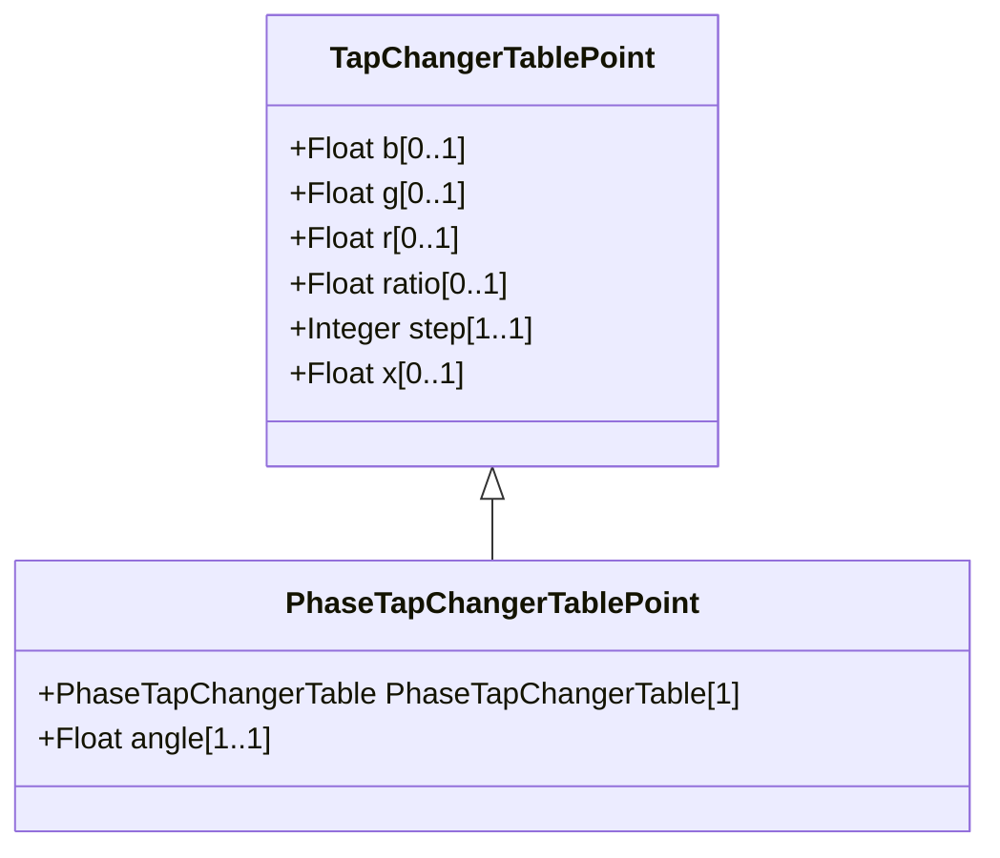

# PhaseTapChangerTablePoint

Describes each tap step in the phase tap changer tabular curve.

## Inheritance

<button class="mermaid-enlarge-button">Enlarge Diagram</button>

## Attributes

| Label | Type | Multiplicity | Comment |
|-------|------|--------------|---------|
| PhaseTapChangerTable | [PhaseTapChangerTable](PhaseTapChangerTable.md) | 1 | The table of this point. |
| angle | Float | 1..1 | The angle difference in degrees. A positive value indicates a positive angle variation from the Terminal at the PowerTransformerEnd, where the TapChanger is located, into the transformer. |

