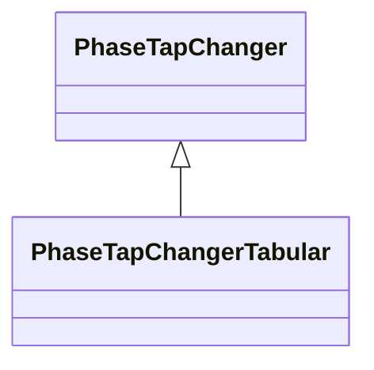

# PhaseTapChangerTabular

Describes a tap changer with a table defining the relation between the tap step and the phase angle difference across the transformer.

## Inheritance

<button class="mermaid-enlarge-button">Enlarge Diagram</button>

## Attributes

| Label | Type | Multiplicity | Comment |
|-------|------|--------------|---------|
| PhaseTapChangerTable | [PhaseTapChangerTable](PhaseTapChangerTable.md) | 1 | The phase tap changer table for this phase tap changer. |

