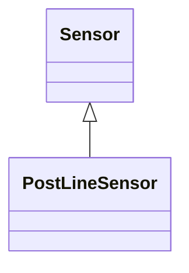

# PostLineSensor

A sensor used mainly in overhead distribution networks as the source of both current and voltage measurements.

## Inheritance

<button class="mermaid-enlarge-button">Enlarge Diagram</button>

## Attributes

| Label | Type | Multiplicity | Comment |
|-------|------|--------------|---------|
| No attributes | | | |

