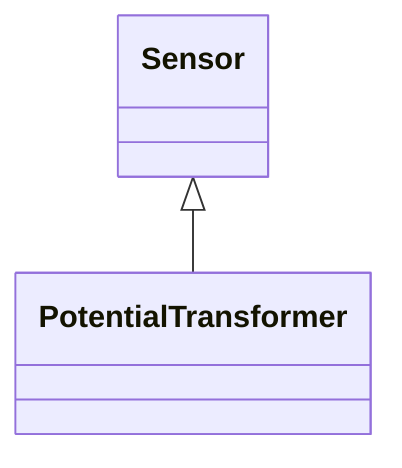

# PotentialTransformer

Instrument transformer (also known as Voltage Transformer) used to measure electrical qualities of the circuit that is being protected and/or monitored. Typically used as voltage transducer for the purpose of metering, protection, or sometimes auxiliary substation supply. A typical secondary voltage rating would be 120V.

## Inheritance

<button class="mermaid-enlarge-button">Enlarge Diagram</button>

## Attributes

| Label | Type | Multiplicity | Comment |
|-------|------|--------------|---------|
| No attributes | | | |

