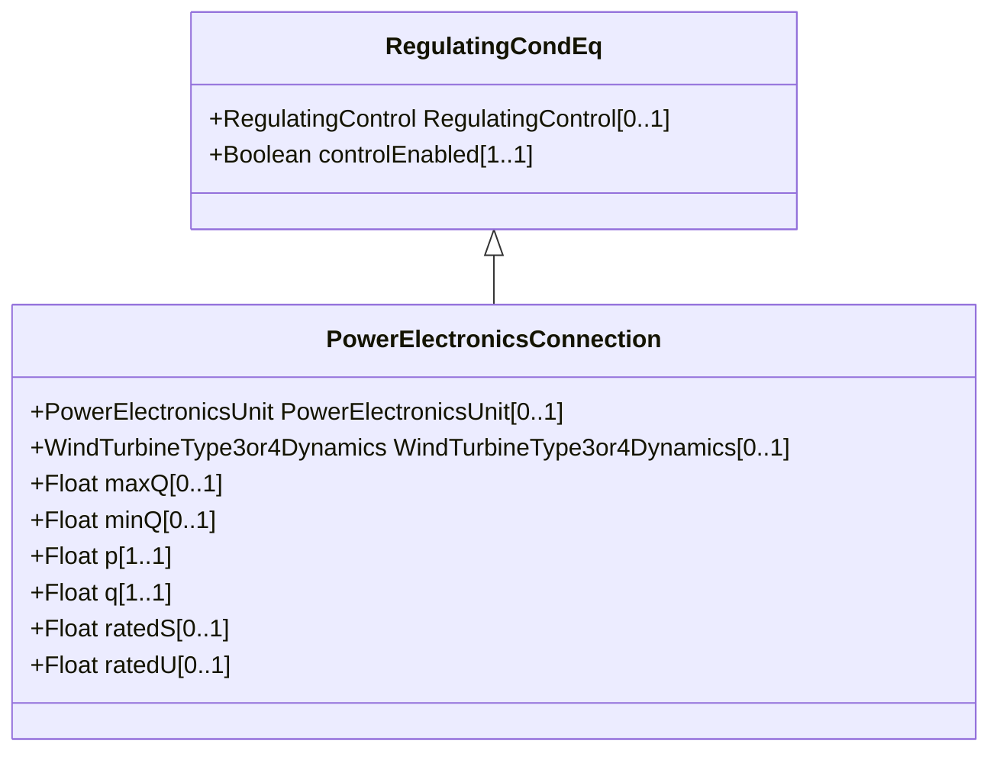

# PowerElectronicsConnection

A connection to the AC network for energy production or consumption that uses power electronics rather than rotating machines.

## Inheritance

<button class="mermaid-enlarge-button">Enlarge Diagram</button>

## Attributes

| Label | Type | Multiplicity | Comment |
|-------|------|--------------|---------|
| PowerElectronicsUnit | [PowerElectronicsUnit](PowerElectronicsUnit.md) | 0..1 | An AC network connection may have several power electronics units connecting through it. |
| WindTurbineType3or4Dynamics | [WindTurbineType3or4Dynamics](WindTurbineType3or4Dynamics.md) | 0..1 | The wind turbine type 3 or type 4 dynamics model associated with this power electronics connection. |
| maxQ | Float | 0..1 | Maximum reactive power limit. This is the maximum (nameplate) limit for the unit. |
| minQ | Float | 0..1 | Minimum reactive power limit for the unit. This is the minimum (nameplate) limit for the unit. |
| p | Float | 1..1 | Active power injection. Load sign convention is used, i.e. positive sign means flow out from a node. Starting value for a steady state solution. |
| q | Float | 1..1 | Reactive power injection. Load sign convention is used, i.e. positive sign means flow out from a node. Starting value for a steady state solution. |
| ratedS | Float | 0..1 | Nameplate apparent power rating for the unit. The attribute shall have a positive value. |
| ratedU | Float | 0..1 | Rated voltage (nameplate data, Ur in IEC 60909-0). It is primarily used for short circuit data exchange according to IEC 60909. The attribute shall be a positive value. |

