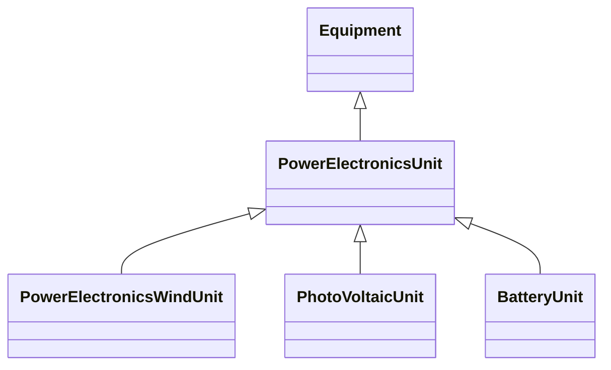

# PowerElectronicsUnit

A generating unit or battery or aggregation that connects to the AC network using power electronics rather than rotating machines.

## Inheritance

<button class="mermaid-enlarge-button">Enlarge Diagram</button>

## Attributes

| Label | Type | Multiplicity | Comment |
|-------|------|--------------|---------|
| PowerElectronicsConnection | [PowerElectronicsConnection](PowerElectronicsConnection.md) | 1 | A power electronics unit has a connection to the AC network. |
| maxP | Float | 0..1 | Maximum active power limit. This is the maximum (nameplate) limit for the unit. |
| minP | Float | 0..1 | Minimum active power limit. This is the minimum (nameplate) limit for the unit. |

