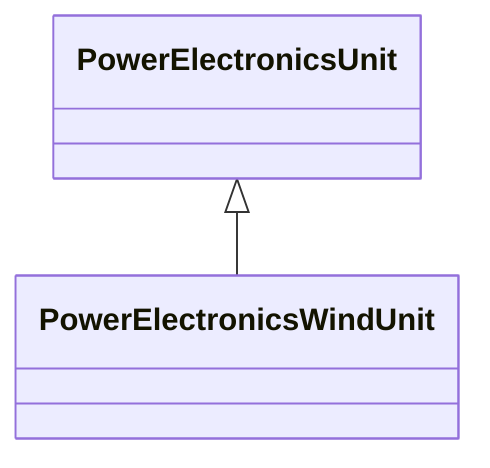

# PowerElectronicsWindUnit

A wind generating unit that connects to the AC network with power electronics rather than rotating machines or an aggregation of such units.

## Inheritance

<button class="mermaid-enlarge-button">Enlarge Diagram</button>

## Attributes

| Label | Type | Multiplicity | Comment |
|-------|------|--------------|---------|
| No attributes | | | |

