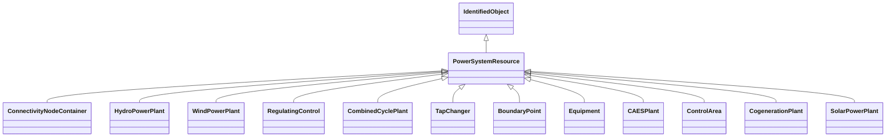

# PowerSystemResource

A power system resource (PSR) can be an item of equipment such as a switch, an equipment container containing many individual items of equipment such as a substation, or an organisational entity such as sub-control area. Power system resources can have measurements associated.

## Inheritance

<button class="mermaid-enlarge-button">Enlarge Diagram</button>

## Attributes

| Label | Type | Multiplicity | Comment |
|-------|------|--------------|---------|
| Controls | [Control](Control.md) | 0..n | The controller outputs used to actually govern a regulating device, e.g. the magnetization of a synchronous machine or capacitor bank breaker actuator. |
| Location | [Location](Location.md) | 0..1 | Location of this power system resource. |
| Measurements | [Measurement](Measurement.md) | 0..n | The measurements associated with this power system resource. |

