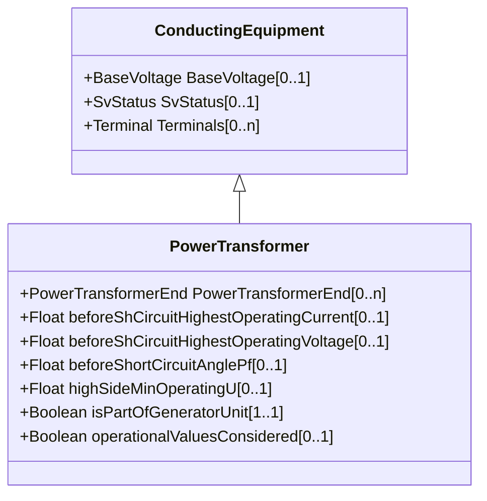

# PowerTransformer

An electrical device consisting of two or more coupled windings, with or without a magnetic core, for introducing mutual coupling between electric circuits. Transformers can be used to control voltage and phase shift (active power flow). A power transformer may be composed of separate transformer tanks that need not be identical. A power transformer can be modelled with or without tanks and is intended for use in both balanced and unbalanced representations. A power transformer typically has two terminals, but may have one (grounding), three or more terminals. The inherited association ConductingEquipment.BaseVoltage should not be used. The association from TransformerEnd to BaseVoltage should be used instead.

## Inheritance

<button class="mermaid-enlarge-button">Enlarge Diagram</button>

## Attributes

| Label | Type | Multiplicity | Comment |
|-------|------|--------------|---------|
| PowerTransformerEnd | [PowerTransformerEnd](PowerTransformerEnd.md) | 0..n | The ends of this power transformer. |
| beforeShCircuitHighestOperatingCurrent | Float | 0..1 | The highest operating current (Ib in IEC 60909-0) before short circuit (depends on network configuration and relevant reliability philosophy). It is used for calculation of the impedance correction factor KT defined in IEC 60909-0. |
| beforeShCircuitHighestOperatingVoltage | Float | 0..1 | The highest operating voltage (Ub in IEC 60909-0) before short circuit. It is used for calculation of the impedance correction factor KT defined in IEC 60909-0. This is worst case voltage on the low side winding (3.7.1 of IEC 60909:2001). Used to define operating conditions. |
| beforeShortCircuitAnglePf | Float | 0..1 | The angle of power factor before short circuit (phib in IEC 60909-0). It is used for calculation of the impedance correction factor KT defined in IEC 60909-0. This is the worst case power factor. Used to define operating conditions. |
| highSideMinOperatingU | Float | 0..1 | The minimum operating voltage (uQmin in IEC 60909-0) at the high voltage side (Q side) of the unit transformer of the power station unit. A value well established from long-term operating experience of the system. It is used for calculation of the impedance correction factor KG defined in IEC 60909-0. |
| isPartOfGeneratorUnit | Boolean | 1..1 | Indicates whether the machine is part of a power station unit. Used for short circuit data exchange according to IEC 60909. It has an impact on how the correction factors are calculated for transformers, since the transformer is not necessarily part of a synchronous machine and generating unit. It is not always possible to derive this information from the model. This is why the attribute is necessary. |
| operationalValuesConsidered | Boolean | 0..1 | It is used to define if the data (other attributes related to short circuit data exchange) defines long term operational conditions or not. Used for short circuit data exchange according to IEC 60909. |

