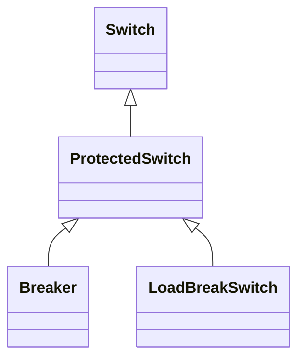

# ProtectedSwitch

A ProtectedSwitch is a switching device that can be operated by ProtectionEquipment.

## Inheritance

<button class="mermaid-enlarge-button">Enlarge Diagram</button>

## Attributes

| Label | Type | Multiplicity | Comment |
|-------|------|--------------|---------|
| No attributes | | | |

