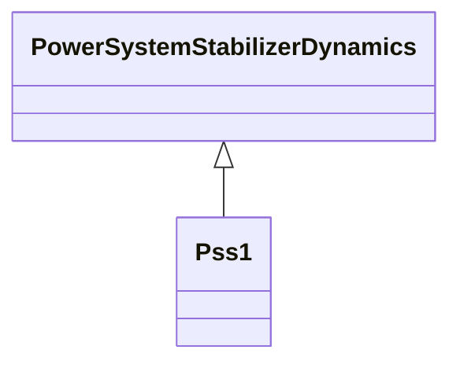

# Pss1

Italian PSS with three inputs (speed, frequency, power).

## Inheritance

<button class="mermaid-enlarge-button">Enlarge Diagram</button>

## Attributes

| Label | Type | Multiplicity | Comment |
|-------|------|--------------|---------|
| kf | Float | 1..1 | Frequency power input gain (KF). Typical value = 5. |
| komega | Float | 1..1 | Shaft speed power input gain (Komega). Typical value = 0. |
| kpe | Float | 1..1 | Electric power input gain (KPE). Typical value = 0,3. |
| ks | Float | 1..1 | PSS gain (Ks). Typical value = 1. |
| pmin | Float | 1..1 | Minimum power PSS enabling (Pmin). Typical value = 0,25. |
| t10 | Float | 1..1 | Lead/lag time constant (T10) (>= 0). Typical value = 0. |
| t5 | Float | 1..1 | Washout (T5) (>= 0). Typical value = 3,5. |
| t6 | Float | 1..1 | Filter time constant (T6) (>= 0). Typical value = 0. |
| t7 | Float | 1..1 | Lead/lag time constant (T7) (>= 0). If = 0, both blocks are bypassed. Typical value = 0. |
| t8 | Float | 1..1 | Lead/lag time constant (T8) (>= 0). Typical value = 0. |
| t9 | Float | 1..1 | Lead/lag time constant (T9) (>= 0). If = 0, both blocks are bypassed. Typical value = 0. |
| tpe | Float | 1..1 | Electric power filter time constant (TPE) (>= 0). Typical value = 0,05. |
| vadat | Boolean | 1..1 | Signal selector (VADAT). true = closed (generator power is greater than Pmin) false = open (Pe is smaller than Pmin). Typical value = true. |
| vsmn | Float | 1..1 | Stabilizer output maximum limit (VSMN). Typical value = -0,06. |
| vsmx | Float | 1..1 | Stabilizer output minimum limit (VSMX). Typical value = 0,06. |

