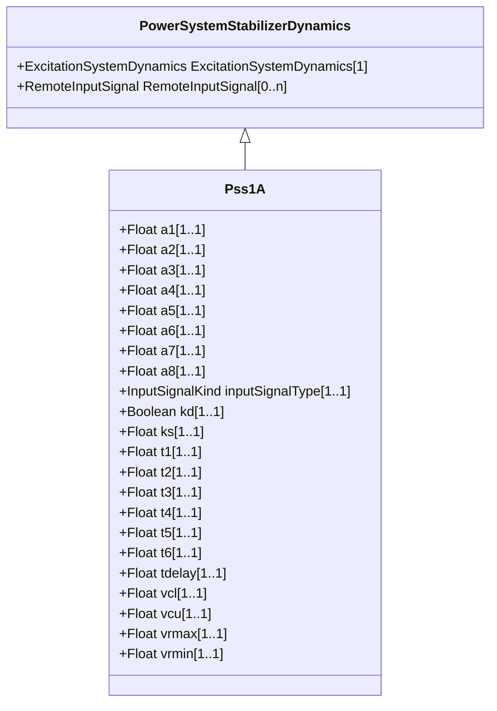

# Pss1A

Single input power system stabilizer. It is a modified version in order to allow representation of various vendors' implementations on PSS type 1A.

## Inheritance

<button class="mermaid-enlarge-button">Enlarge Diagram</button>

## Attributes

| Label | Type | Multiplicity | Comment |
|-------|------|--------------|---------|
| a1 | Float | 1..1 | Notch filter parameter (A1). |
| a2 | Float | 1..1 | Notch filter parameter (A2). |
| a3 | Float | 1..1 | Notch filter parameter (A3). |
| a4 | Float | 1..1 | Notch filter parameter (A4). |
| a5 | Float | 1..1 | Notch filter parameter (A5). |
| a6 | Float | 1..1 | Notch filter parameter (A6). |
| a7 | Float | 1..1 | Notch filter parameter (A7). |
| a8 | Float | 1..1 | Notch filter parameter (A8). |
| inputSignalType | [InputSignalKind](InputSignalKind.md) | 1..1 | Type of input signal (rotorAngularFrequencyDeviation, busFrequencyDeviation, generatorElectricalPower, generatorAcceleratingPower, busVoltage, or busVoltageDerivative). |
| kd | Boolean | 1..1 | Selector (Kd). true = e-sTdelay used false = e-sTdelay not used. |
| ks | Float | 1..1 | Stabilizer gain (Ks). |
| t1 | Float | 1..1 | Lead/lag time constant (T1) (>= 0). |
| t2 | Float | 1..1 | Lead/lag time constant (T2) (>= 0). |
| t3 | Float | 1..1 | Lead/lag time constant (T3) (>= 0). |
| t4 | Float | 1..1 | Lead/lag time constant (T4) (>= 0). |
| t5 | Float | 1..1 | Washout time constant (T5) (>= 0). |
| t6 | Float | 1..1 | Transducer time constant (T6) (>= 0). |
| tdelay | Float | 1..1 | Time constant (Tdelay) (>= 0). |
| vcl | Float | 1..1 | Stabilizer input cutoff threshold (Vcl). |
| vcu | Float | 1..1 | Stabilizer input cutoff threshold (Vcu). |
| vrmax | Float | 1..1 | Maximum stabilizer output (Vrmax) (> Pss1A.vrmin). |
| vrmin | Float | 1..1 | Minimum stabilizer output (Vrmin) (< Pss1A.vrmax). |

