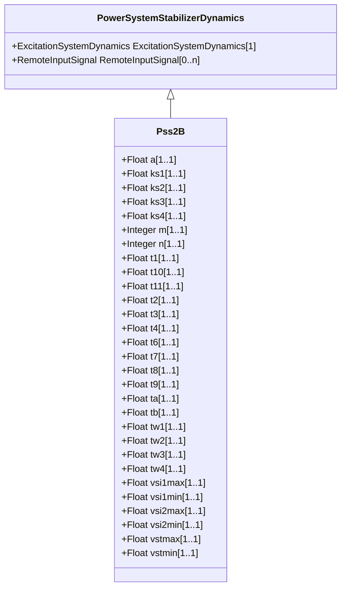

# Pss2B

Modified IEEE PSS2B. Extra lead/lag (or rate) block added at end (up to 4 lead/lags total).

## Inheritance

<button class="mermaid-enlarge-button">Enlarge Diagram</button>

## Attributes

| Label | Type | Multiplicity | Comment |
|-------|------|--------------|---------|
| a | Float | 1..1 | Numerator constant (a). Typical value = 1. |
| ks1 | Float | 1..1 | Stabilizer gain (Ks1). Typical value = 12. |
| ks2 | Float | 1..1 | Gain on signal #2 (Ks2). Typical value = 0,2. |
| ks3 | Float | 1..1 | Gain on signal #2 input before ramp-tracking filter (Ks3). Typical value = 1. |
| ks4 | Float | 1..1 | Gain on signal #2 input after ramp-tracking filter (Ks4). Typical value = 1. |
| m | Integer | 1..1 | Denominator order of ramp tracking filter (m). Typical value = 5. |
| n | Integer | 1..1 | Order of ramp tracking filter (n). Typical value = 1. |
| t1 | Float | 1..1 | Lead/lag time constant (T1) (>= 0). Typical value = 0,12. |
| t10 | Float | 1..1 | Lead/lag time constant (T10) (>= 0). Typical value = 0. |
| t11 | Float | 1..1 | Lead/lag time constant (T11) (>= 0). Typical value = 0. |
| t2 | Float | 1..1 | Lead/lag time constant (T2) (>= 0). Typical value = 0,02. |
| t3 | Float | 1..1 | Lead/lag time constant (T3) (>= 0). Typical value = 0,3. |
| t4 | Float | 1..1 | Lead/lag time constant (T4) (>= 0). Typical value = 0,02. |
| t6 | Float | 1..1 | Time constant on signal #1 (T6) (>= 0). Typical value = 0. |
| t7 | Float | 1..1 | Time constant on signal #2 (T7) (>= 0). Typical value = 2. |
| t8 | Float | 1..1 | Lead of ramp tracking filter (T8) (>= 0). Typical value = 0,2. |
| t9 | Float | 1..1 | Lag of ramp tracking filter (T9) (>= 0). Typical value = 0,1. |
| ta | Float | 1..1 | Lead constant (Ta) (>= 0). Typical value = 0. |
| tb | Float | 1..1 | Lag time constant (Tb) (>= 0). Typical value = 0. |
| tw1 | Float | 1..1 | First washout on signal #1 (Tw1) (>= 0). Typical value = 2. |
| tw2 | Float | 1..1 | Second washout on signal #1 (Tw2) (>= 0). Typical value = 2. |
| tw3 | Float | 1..1 | First washout on signal #2 (Tw3) (>= 0). Typical value = 2. |
| tw4 | Float | 1..1 | Second washout on signal #2 (Tw4) (>= 0). Typical value = 0. |
| vsi1max | Float | 1..1 | Input signal #1 maximum limit (Vsi1max) (> Pss2B.vsi1min). Typical value = 2. |
| vsi1min | Float | 1..1 | Input signal #1 minimum limit (Vsi1min) (< Pss2B.vsi1max). Typical value = -2. |
| vsi2max | Float | 1..1 | Input signal #2 maximum limit (Vsi2max) (> Pss2B.vsi2min). Typical value = 2. |
| vsi2min | Float | 1..1 | Input signal #2 minimum limit (Vsi2min) (< Pss2B.vsi2max). Typical value = -2. |
| vstmax | Float | 1..1 | Stabilizer output maximum limit (Vstmax) (> Pss2B.vstmin). Typical value = 0,1. |
| vstmin | Float | 1..1 | Stabilizer output minimum limit (Vstmin) (< Pss2B.vstmax). Typical value = -0,1. |

