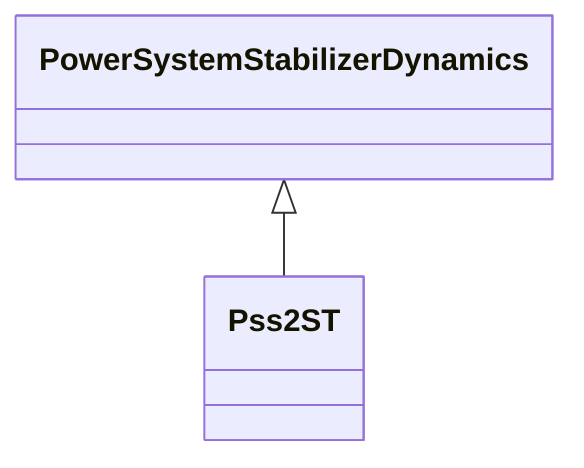

# Pss2ST

PTI microprocessor-based stabilizer type 1.

## Inheritance

<button class="mermaid-enlarge-button">Enlarge Diagram</button>

## Attributes

| Label | Type | Multiplicity | Comment |
|-------|------|--------------|---------|
| inputSignal1Type | [InputSignalKind](InputSignalKind.md) | 1..1 | Type of input signal #1 (rotorAngularFrequencyDeviation, busFrequencyDeviation, generatorElectricalPower, generatorAcceleratingPower, busVoltage, or busVoltageDerivative - shall be different than Pss2ST.inputSignal2Type). Typical value = rotorAngularFrequencyDeviation. |
| inputSignal2Type | [InputSignalKind](InputSignalKind.md) | 1..1 | Type of input signal #2 (rotorAngularFrequencyDeviation, busFrequencyDeviation, generatorElectricalPower, generatorAcceleratingPower, busVoltage, or busVoltageDerivative - shall be different than Pss2ST.inputSignal1Type). Typical value = busVoltageDerivative. |
| k1 | Float | 1..1 | Gain (K1). |
| k2 | Float | 1..1 | Gain (K2). |
| lsmax | Float | 1..1 | Limiter (LSMAX) (> Pss2ST.lsmin). |
| lsmin | Float | 1..1 | Limiter (LSMIN) (< Pss2ST.lsmax). |
| t1 | Float | 1..1 | Time constant (T1) (>= 0). |
| t10 | Float | 1..1 | Time constant (T10) (>= 0). |
| t2 | Float | 1..1 | Time constant (T2) (>= 0). |
| t3 | Float | 1..1 | Time constant (T3) (>= 0). |
| t4 | Float | 1..1 | Time constant (T4) (>= 0). |
| t5 | Float | 1..1 | Time constant (T5) (>= 0). |
| t6 | Float | 1..1 | Time constant (T6) (>= 0). |
| t7 | Float | 1..1 | Time constant (T7) (>= 0). |
| t8 | Float | 1..1 | Time constant (T8) (>= 0). |
| t9 | Float | 1..1 | Time constant (T9) (>= 0). |
| vcl | Float | 1..1 | Cutoff limiter (VCL). |
| vcu | Float | 1..1 | Cutoff limiter (VCU). |

