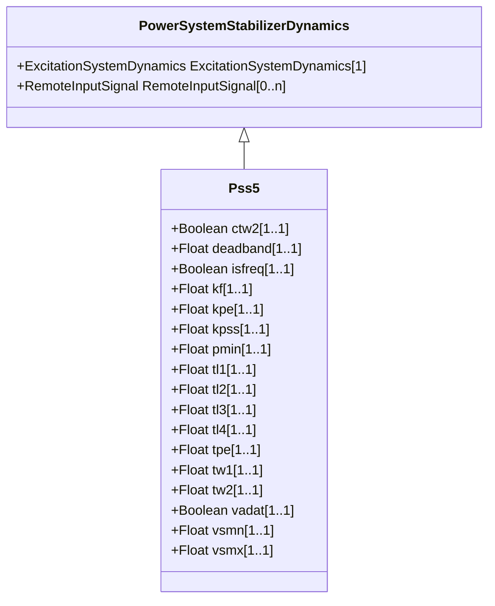

# Pss5

Detailed Italian PSS.

## Inheritance

<button class="mermaid-enlarge-button">Enlarge Diagram</button>

## Attributes

| Label | Type | Multiplicity | Comment |
|-------|------|--------------|---------|
| ctw2 | Boolean | 1..1 | Selector for second washout enabling (CTW2). true = second washout filter is bypassed false = second washout filter in use. Typical value = true. |
| deadband | Float | 1..1 | Stabilizer output deadband (DEADBAND). Typical value = 0. |
| isfreq | Boolean | 1..1 | Selector for frequency/shaft speed input (isFreq). true = speed (same meaning as InputSignaKind.rotorSpeed) false = frequency (same meaning as InputSignalKind.busFrequency). Typical value = true (same meaning as InputSignalKind.rotorSpeed). |
| kf | Float | 1..1 | Frequency/shaft speed input gain (KF). Typical value = 5. |
| kpe | Float | 1..1 | Electric power input gain (KPE). Typical value = 0,3. |
| kpss | Float | 1..1 | PSS gain (KPSS). Typical value = 1. |
| pmin | Float | 1..1 | Minimum power PSS enabling (Pmin). Typical value = 0,25. |
| tl1 | Float | 1..1 | Lead/lag time constant (TL1) (>= 0). Typical value = 0. |
| tl2 | Float | 1..1 | Lead/lag time constant (TL2) (>= 0). If = 0, both blocks are bypassed. Typical value = 0. |
| tl3 | Float | 1..1 | Lead/lag time constant (TL3) (>= 0). Typical value = 0. |
| tl4 | Float | 1..1 | Lead/lag time constant (TL4) (>= 0). If = 0, both blocks are bypassed. Typical value = 0. |
| tpe | Float | 1..1 | Electric power filter time constant (TPE) (>= 0). Typical value = 0,05. |
| tw1 | Float | 1..1 | First washout (TW1) (>= 0). Typical value = 3,5. |
| tw2 | Float | 1..1 | Second washout (TW2) (>= 0). Typical value = 0. |
| vadat | Boolean | 1..1 | Signal selector (VadAtt). true = closed (generator power is greater than Pmin) false = open (Pe is smaller than Pmin). Typical value = true. |
| vsmn | Float | 1..1 | Stabilizer output maximum limit (VSMN). Typical value = -0,1. |
| vsmx | Float | 1..1 | Stabilizer output minimum limit (VSMX). Typical value = 0,1. |

