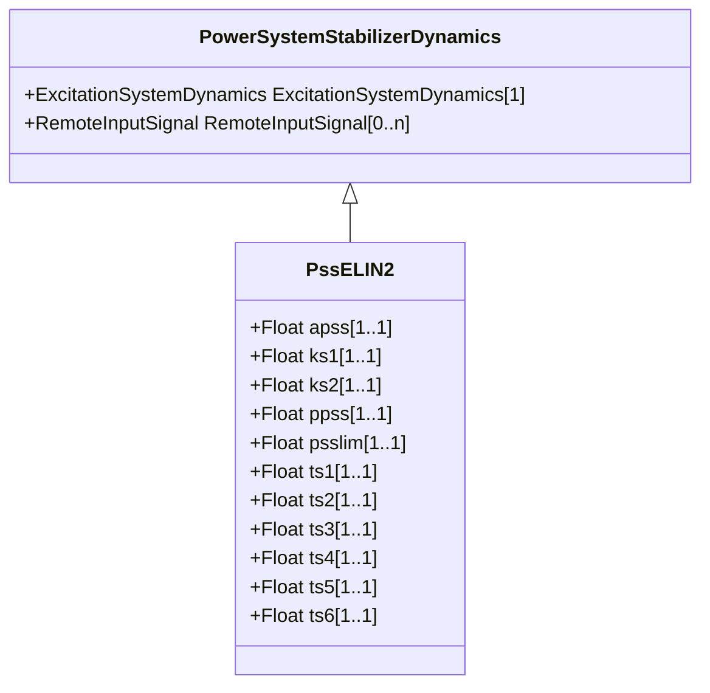

# PssELIN2

Power system stabilizer typically associated with ExcELIN2 (though PssIEEE2B or Pss2B can also be used).

## Inheritance

<button class="mermaid-enlarge-button">Enlarge Diagram</button>

## Attributes

| Label | Type | Multiplicity | Comment |
|-------|------|--------------|---------|
| apss | Float | 1..1 | Coefficient (a_PSS). Typical value = 0,1. |
| ks1 | Float | 1..1 | Gain (Ks1). Typical value = 1. |
| ks2 | Float | 1..1 | Gain (Ks2). Typical value = 0,1. |
| ppss | Float | 1..1 | Coefficient (p_PSS) (>= 0 and <= 4). Typical value = 0,1. |
| psslim | Float | 1..1 | PSS limiter (psslim). Typical value = 0,1. |
| ts1 | Float | 1..1 | Time constant (Ts1) (>= 0). Typical value = 0. |
| ts2 | Float | 1..1 | Time constant (Ts2) (>= 0). Typical value = 1. |
| ts3 | Float | 1..1 | Time constant (Ts3) (>= 0). Typical value = 1. |
| ts4 | Float | 1..1 | Time constant (Ts4) (>= 0). Typical value = 0,1. |
| ts5 | Float | 1..1 | Time constant (Ts5) (>= 0). Typical value = 0. |
| ts6 | Float | 1..1 | Time constant (Ts6) (>= 0). Typical value = 1. |

