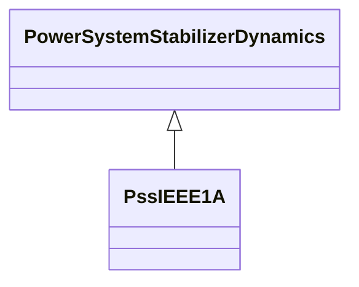

# PssIEEE1A

IEEE 421.5-2005 type PSS1A power system stabilizer model. PSS1A is the generalized form of a PSS with a single input signal. Reference: IEEE 1A 421.5-2005, 8.1.

## Inheritance

<button class="mermaid-enlarge-button">Enlarge Diagram</button>

## Attributes

| Label | Type | Multiplicity | Comment |
|-------|------|--------------|---------|
| a1 | Float | 1..1 | PSS signal conditioning frequency filter constant (A1). Typical value = 0,061. |
| a2 | Float | 1..1 | PSS signal conditioning frequency filter constant (A2). Typical value = 0,0017. |
| inputSignalType | [InputSignalKind](InputSignalKind.md) | 1..1 | Type of input signal (rotorAngularFrequencyDeviation, generatorElectricalPower, or busFrequencyDeviation). Typical value = rotorAngularFrequencyDeviation. |
| ks | Float | 1..1 | Stabilizer gain (Ks). Typical value = 5. |
| t1 | Float | 1..1 | Lead/lag time constant (T1) (>= 0). Typical value = 0,3. |
| t2 | Float | 1..1 | Lead/lag time constant (T2) (>= 0). Typical value = 0,03. |
| t3 | Float | 1..1 | Lead/lag time constant (T3) (>= 0). Typical value = 0,3. |
| t4 | Float | 1..1 | Lead/lag time constant (T4) (>= 0). Typical value = 0,03. |
| t5 | Float | 1..1 | Washout time constant (T5) (>= 0). Typical value = 10. |
| t6 | Float | 1..1 | Transducer time constant (T6) (>= 0). Typical value = 0,01. |
| vrmax | Float | 1..1 | Maximum stabilizer output (Vrmax) (> PssIEEE1A.vrmin). Typical value = 0,05. |
| vrmin | Float | 1..1 | Minimum stabilizer output (Vrmin) (< PssIEEE1A.vrmax). Typical value = -0,05. |

