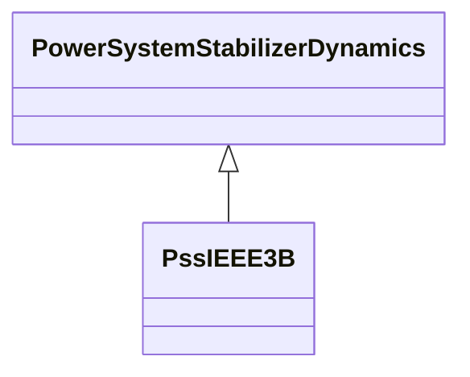

# PssIEEE3B

IEEE 421.5-2005 type PSS3B power system stabilizer model. The PSS model PSS3B has dual inputs of electrical power and rotor angular frequency deviation. The signals are used to derive an equivalent mechanical power signal. This model has 2 input signals. They have the following fixed types (expressed in terms of InputSignalKind values): the first one is of rotorAngleFrequencyDeviation type and the second one is of generatorElectricalPower type. Reference: IEEE 3B 421.5-2005, 8.3.

## Inheritance

<button class="mermaid-enlarge-button">Enlarge Diagram</button>

## Attributes

| Label | Type | Multiplicity | Comment |
|-------|------|--------------|---------|
| a1 | Float | 1..1 | Notch filter parameter (A1). Typical value = 0,359. |
| a2 | Float | 1..1 | Notch filter parameter (A2). Typical value = 0,586. |
| a3 | Float | 1..1 | Notch filter parameter (A3). Typical value = 0,429. |
| a4 | Float | 1..1 | Notch filter parameter (A4). Typical value = 0,564. |
| a5 | Float | 1..1 | Notch filter parameter (A5). Typical value = 0,001. |
| a6 | Float | 1..1 | Notch filter parameter (A6). Typical value = 0. |
| a7 | Float | 1..1 | Notch filter parameter (A7). Typical value = 0,031. |
| a8 | Float | 1..1 | Notch filter parameter (A8). Typical value = 0. |
| ks1 | Float | 1..1 | Gain on signal # 1 (Ks1). Typical value = -0,602. |
| ks2 | Float | 1..1 | Gain on signal # 2 (Ks2). Typical value = 30,12. |
| t1 | Float | 1..1 | Transducer time constant (T1) (>= 0). Typical value = 0,012. |
| t2 | Float | 1..1 | Transducer time constant (T2) (>= 0). Typical value = 0,012. |
| tw1 | Float | 1..1 | Washout time constant (Tw1) (>= 0). Typical value = 0,3. |
| tw2 | Float | 1..1 | Washout time constant (Tw2) (>= 0). Typical value = 0,3. |
| tw3 | Float | 1..1 | Washout time constant (Tw3) (>= 0). Typical value = 0,6. |
| vstmax | Float | 1..1 | Stabilizer output maximum limit (Vstmax) (> PssIEEE3B.vstmin). Typical value = 0,1. |
| vstmin | Float | 1..1 | Stabilizer output minimum limit (Vstmin) (< PssIEEE3B.vstmax). Typical value = -0,1. |

