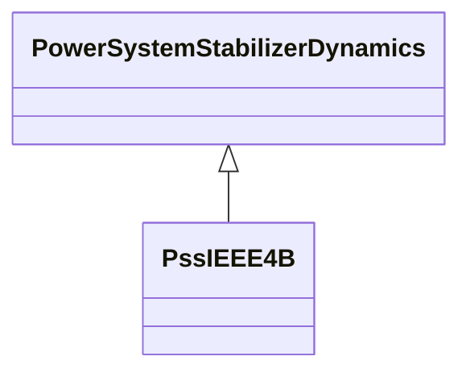

# PssIEEE4B

IEEE 421.5-2005 type PSS4B power system stabilizer. The PSS4B model represents a structure based on multiple working frequency bands. Three separate bands, respectively dedicated to the low-, intermediate- and high-frequency modes of oscillations, are used in this delta omega (speed input) PSS. There is an error in the in IEEE 421.5-2005 PSS4B model: the Pe input should read -Pe. This implies that the input Pe needs to be multiplied by -1. Reference: IEEE 4B 421.5-2005, 8.4. Parameter details: This model has 2 input signals. They have the following fixed types (expressed in terms of InputSignalKind values): the first one is of rotorAngleFrequencyDeviation type and the second one is of generatorElectricalPower type.

## Inheritance

<button class="mermaid-enlarge-button">Enlarge Diagram</button>

## Attributes

| Label | Type | Multiplicity | Comment |
|-------|------|--------------|---------|
| bwh1 | Float | 1..1 | Notch filter 1 (high-frequency band): three dB bandwidth (Bwi). |
| bwh2 | Float | 1..1 | Notch filter 2 (high-frequency band): three dB bandwidth (Bwi). |
| bwl1 | Float | 1..1 | Notch filter 1 (low-frequency band): three dB bandwidth (Bwi). |
| bwl2 | Float | 1..1 | Notch filter 2 (low-frequency band): three dB bandwidth (Bwi). |
| kh | Float | 1..1 | High band gain (KH). Typical value = 120. |
| kh1 | Float | 1..1 | High band differential filter gain (KH1). Typical value = 66. |
| kh11 | Float | 1..1 | High band first lead-lag blocks coefficient (KH11). Typical value = 1. |
| kh17 | Float | 1..1 | High band first lead-lag blocks coefficient (KH17). Typical value = 1. |
| kh2 | Float | 1..1 | High band differential filter gain (KH2). Typical value = 66. |
| ki | Float | 1..1 | Intermediate band gain (KI). Typical value = 30. |
| ki1 | Float | 1..1 | Intermediate band differential filter gain (KI1). Typical value = 66. |
| ki11 | Float | 1..1 | Intermediate band first lead-lag blocks coefficient (KI11). Typical value = 1. |
| ki17 | Float | 1..1 | Intermediate band first lead-lag blocks coefficient (KI17). Typical value = 1. |
| ki2 | Float | 1..1 | Intermediate band differential filter gain (KI2). Typical value = 66. |
| kl | Float | 1..1 | Low band gain (KL). Typical value = 7.5. |
| kl1 | Float | 1..1 | Low band differential filter gain (KL1). Typical value = 66. |
| kl11 | Float | 1..1 | Low band first lead-lag blocks coefficient (KL11). Typical value = 1. |
| kl17 | Float | 1..1 | Low band first lead-lag blocks coefficient (KL17). Typical value = 1. |
| kl2 | Float | 1..1 | Low band differential filter gain (KL2). Typical value = 66. |
| omeganh1 | Float | 1..1 | Notch filter 1 (high-frequency band): filter frequency (omegani). |
| omeganh2 | Float | 1..1 | Notch filter 2 (high-frequency band): filter frequency (omegani). |
| omeganl1 | Float | 1..1 | Notch filter 1 (low-frequency band): filter frequency (omegani). |
| omeganl2 | Float | 1..1 | Notch filter 2 (low-frequency band): filter frequency (omegani). |
| th1 | Float | 1..1 | High band time constant (TH1) (>= 0). Typical value = 0,01513. |
| th10 | Float | 1..1 | High band time constant (TH10) (>= 0). Typical value = 0. |
| th11 | Float | 1..1 | High band time constant (TH11) (>= 0). Typical value = 0. |
| th12 | Float | 1..1 | High band time constant (TH12) (>= 0). Typical value = 0. |
| th2 | Float | 1..1 | High band time constant (TH2) (>= 0). Typical value = 0,01816. |
| th3 | Float | 1..1 | High band time constant (TH3) (>= 0). Typical value = 0. |
| th4 | Float | 1..1 | High band time constant (TH4) (>= 0). Typical value = 0. |
| th5 | Float | 1..1 | High band time constant (TH5) (>= 0). Typical value = 0. |
| th6 | Float | 1..1 | High band time constant (TH6) (>= 0). Typical value = 0. |
| th7 | Float | 1..1 | High band time constant (TH7) (>= 0). Typical value = 0,01816. |
| th8 | Float | 1..1 | High band time constant (TH8) (>= 0). Typical value = 0,02179. |
| th9 | Float | 1..1 | High band time constant (TH9) (>= 0). Typical value = 0. |
| ti1 | Float | 1..1 | Intermediate band time constant (TI1) (>= 0). Typical value = 0,173. |
| ti10 | Float | 1..1 | Intermediate band time constant (TI10) (>= 0). Typical value = 0. |
| ti11 | Float | 1..1 | Intermediate band time constant (TI11) (>= 0). Typical value = 0. |
| ti12 | Float | 1..1 | Intermediate band time constant (TI12) (>= 0). Typical value = 0. |
| ti2 | Float | 1..1 | Intermediate band time constant (TI2) (>= 0). Typical value = 0,2075. |
| ti3 | Float | 1..1 | Intermediate band time constant (TI3) (>= 0). Typical value = 0. |
| ti4 | Float | 1..1 | Intermediate band time constant (TI4) (>= 0). Typical value = 0. |
| ti5 | Float | 1..1 | Intermediate band time constant (TI5) (>= 0). Typical value = 0. |
| ti6 | Float | 1..1 | Intermediate band time constant (TI6) (>= 0). Typical value = 0. |
| ti7 | Float | 1..1 | Intermediate band time constant (TI7) (>= 0). Typical value = 0,2075. |
| ti8 | Float | 1..1 | Intermediate band time constant (TI8) (>= 0). Typical value = 0,2491. |
| ti9 | Float | 1..1 | Intermediate band time constant (TI9) (>= 0). Typical value = 0. |
| tl1 | Float | 1..1 | Low band time constant (TL1) (>= 0). Typical value = 1,73. |
| tl10 | Float | 1..1 | Low band time constant (TL10) (>= 0). Typical value = 0. |
| tl11 | Float | 1..1 | Low band time constant (TL11) (>= 0). Typical value = 0. |
| tl12 | Float | 1..1 | Low band time constant (TL12) (>= 0). Typical value = 0. |
| tl2 | Float | 1..1 | Low band time constant (TL2) (>= 0). Typical value = 2,075. |
| tl3 | Float | 1..1 | Low band time constant (TL3) (>= 0). Typical value = 0. |
| tl4 | Float | 1..1 | Low band time constant (TL4) (>= 0). Typical value = 0. |
| tl5 | Float | 1..1 | Low band time constant (TL5) (>= 0). Typical value = 0. |
| tl6 | Float | 1..1 | Low band time constant (TL6) (>= 0). Typical value = 0. |
| tl7 | Float | 1..1 | Low band time constant (TL7) (>= 0). Typical value = 2,075. |
| tl8 | Float | 1..1 | Low band time constant (TL8) (>= 0). Typical value = 2,491. |
| tl9 | Float | 1..1 | Low band time constant (TL9) (>= 0). Typical value = 0. |
| vhmax | Float | 1..1 | High band output maximum limit (VHmax) (> PssIEEE4B.vhmin). Typical value = 0,6. |
| vhmin | Float | 1..1 | High band output minimum limit (VHmin) (< PssIEEE4V.vhmax). Typical value = -0,6. |
| vimax | Float | 1..1 | Intermediate band output maximum limit (VImax) (> PssIEEE4B.vimin). Typical value = 0,6. |
| vimin | Float | 1..1 | Intermediate band output minimum limit (VImin) (< PssIEEE4B.vimax). Typical value = -0,6. |
| vlmax | Float | 1..1 | Low band output maximum limit (VLmax) (> PssIEEE4B.vlmin). Typical value = 0,075. |
| vlmin | Float | 1..1 | Low band output minimum limit (VLmin) (< PssIEEE4B.vlmax). Typical value = -0,075. |
| vstmax | Float | 1..1 | PSS output maximum limit (VSTmax) (> PssIEEE4B.vstmin). Typical value = 0,15. |
| vstmin | Float | 1..1 | PSS output minimum limit (VSTmin) (< PssIEEE4B.vstmax). Typical value = -0,15. |

